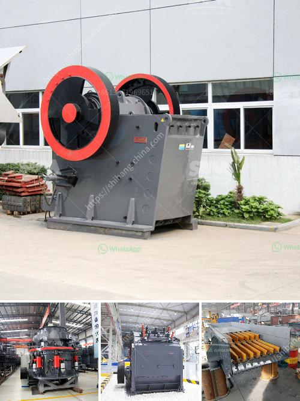

<h3>georgia country stone crusher</h3>
Georgia, located at the crossroads of Western Asia and Eastern Europe, is a land of mesmerizing beauty and rich history. One of its most important contributions to the construction industry is the stone crusher. With its ability to crush marble, granite, and other mineral ores, this machine is an invaluable asset for construction companies.

The stone crusher in Georgia makes use of a high-tech crushing method that enables it to efficiently crush and pulverize rocks into fine dust. This technology ensures that all the valuable minerals contained within the rocks are preserved, while producing consistent, high-quality construction materials.

What makes the stone crusher in Georgia so remarkable is its versatility. It can be used to crush different types of rocks with varying levels of hardness, from soft limestone to robust granite. This flexibility allows construction companies to use this machine for a wide range of projects, from road construction to building foundations.

Furthermore, the stone crusher in Georgia is highly efficient, reducing both material waste and the need for manpower. With its powerful crushing capabilities, it can process large quantities of rocks in a short amount of time. This not only saves construction companies money but also increases their productivity.

In addition to its practicality, the stone crusher in Georgia is also environmentally friendly. By crushing rocks into smaller sizes, it reduces the need for mining new materials. This helps preserve natural resources and minimize the carbon footprint of the construction industry.

Overall, the stone crusher in Georgia is a game-changer for the construction industry. Its ability to efficiently crush rocks into fine dust, combined with its versatility and environmental benefits, make it an essential tool for any construction project. As Georgia continues to grow and develop, the stone crusher will undoubtedly play a crucial role in shaping its infrastructure for years to come.
<h3>Contact us</h3><ul><li><strong>Whatsapp:&nbsp;<a href="https://wa.me/8613661969651">+8613661969651</a></strong></li><li><a href="https://swt.shibang-china.com/?git&amp;zhl&amp;georgia country stone crusher"><strong>Online Service(chat now)</strong></a></li></ul><h3>Related</h3><ul><li><a href='rock crushers ball mill.md'>rock crushers ball mill</a></li><li><a href='crusher machine distributor in zambia.md'>crusher machine distributor in zambia</a></li><li><a href='sale of old hammer crusher.md'>sale of old hammer crusher</a></li><li><a href='project report for quartz stone plant and quarry.md'>project report for quartz stone plant and quarry</a></li><li><a href='stone crushers in kenya.md'>stone crushers in kenya</a></li></ul>