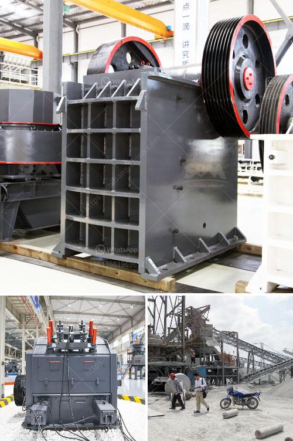

<h3>german crusher manufacturers</h3>
German crusher manufacturers have made a significant impact on the global market. Known worldwide for their precision engineering and innovative designs, they have firmly established themselves as leaders in the industry. With a long history dating back to the 19th century, German crusher manufacturers have always been at the forefront of technology and expertise.

One of the key reasons why German crusher manufacturers have gained such a strong reputation is their commitment to quality. German engineering is renowned for its precision and attention to detail, and this is clearly evident in the crushers they produce. From top-grade materials to state-of-the-art manufacturing processes, German manufacturers ensure that their crushers are made to last.

In addition to quality, German crusher manufacturers are also known for their innovative designs. They continually strive to develop crushers that offer superior performance while also meeting the evolving needs of the industry. Whether it's improving energy efficiency, increasing capacity, or reducing operating costs, German manufacturers are always pushing the boundaries of what is possible.

Another factor that sets German crusher manufacturers apart is their strong focus on customer satisfaction. They understand that each customer has unique requirements, and they work closely with them to develop customized solutions. German manufacturers value open communication and strive to build long-term partnerships with their customers.

Furthermore, German crusher manufacturers are committed to environmental sustainability. They are aware of their responsibility towards the environment and focus on developing crushers that minimize their impact. From using eco-friendly materials to implementing energy-efficient technologies, German manufacturers are actively working towards a greener future.

Overall, German crusher manufacturers have built a solid reputation based on their commitment to quality, innovation, customer satisfaction, and sustainability. With their advanced technology, precision engineering, and customer-focused approach, they continue to drive the industry forward. As the demand for crushers grows worldwide, German manufacturers are well-positioned to meet the needs of the market and maintain their position as leaders in the industry.
<h3>Contact us</h3><ul><li><strong>Whatsapp:&nbsp;<a href="https://wa.me/8613661969651">+8613661969651</a></strong></li><li><a href="https://swt.shibang-china.com/?git&amp;zhl&amp;german crusher manufacturers"><strong>Online Service(chat now)</strong></a></li></ul><h3>Related</h3><ul><li><a href='ball mills for grinding zircon sand.md'>ball mills for grinding zircon sand</a></li><li><a href='conveyor belt manufacturers in bangladesh.md'>conveyor belt manufacturers in bangladesh</a></li><li><a href='manufacturing process of talcum powder.md'>manufacturing process of talcum powder</a></li><li><a href='pebble crushing production line.md'>pebble crushing production line</a></li><li><a href='hard rock quarry cursher in libya.md'>hard rock quarry cursher in libya</a></li></ul>