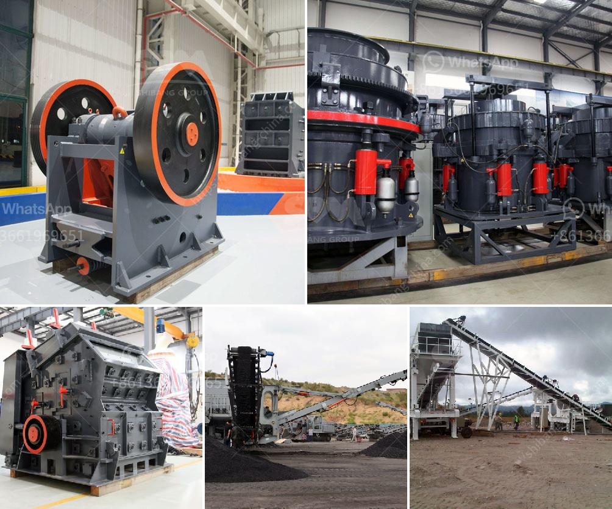

<h3>german grinding mill manufacturer</h3>
For over 150 years, Friedrich Fischer has been a reliable German manufacturer of grinding and milling equipment. In 1883, Friedrich Fischer revolutionized the world of grinding and introduced the first ball mill. Today, Friedrich Fischer continues this tradition of excellence by producing high-quality grinding mills that are extensively used in various industries.

One of the key reasons behind the success of Friedrich Fischer as a grinding mill manufacturer is their commitment to quality. The company has a team of highly skilled engineers and technicians who ensure that every mill produced meets the highest standards of precision and efficiency. This attention to detail is evident in the consistent performance and durability of their products.

Another reason why Friedrich Fischer has become synonymous with grinding mill manufacturing is their continuous innovation. The company invests heavily in research and development to stay at the forefront of technological advancements in the field. This enables them to offer mills that are not only efficient but also incorporate the latest features to enhance productivity.

The range of grinding mills offered by Friedrich Fischer is extensive, catering to various industrial needs. Their mills are used in applications such as mineral processing, cement production, and chemical industries. Thanks to their robust construction and advanced features, these mills can handle heavy workloads while maintaining optimal performance.

In addition to their commitment to quality and innovation, Friedrich Fischer also places great importance on customer satisfaction. They work closely with their clients to understand their specific requirements and provide tailored solutions. Their team of experts offers technical support and guidance throughout the entire process, from selecting the right mill to after-sales service.

One of the hallmarks of Friedrich Fischer is their dedication to sustainability. As a responsible manufacturer, they strive to minimize the environmental impact of their operations. They utilize energy-efficient technologies in their mills and continually explore ways to reduce waste and emissions. This commitment to sustainability has earned them recognition and trust from environmentally conscious customers.

As a German manufacturer, Friedrich Fischer takes pride in their heritage of precision engineering and craftsmanship. They adhere to the highest manufacturing standards to ensure that each grinding mill is of exceptional quality. Their mills are known for their reliability, longevity, and superior performance, making them a preferred choice for industries around the world.

In a rapidly evolving industrial landscape, Friedrich Fischer continues to be a trusted provider of grinding mills. Their commitment to quality, innovation, customer satisfaction, and sustainability sets them apart from other manufacturers. Whether it's for small-scale operations or large industrial projects, Friedrich Fischer offers a comprehensive range of grinding mills that deliver exceptional results.

In conclusion, Friedrich Fischer's long-standing reputation as a German grinding mill manufacturer is well deserved. Their commitment to quality, innovation, customer satisfaction, and sustainability has made them a trusted provider in the industry. With their expertise and advanced technologies, Friedrich Fischer's grinding mills continue to set the benchmark for efficiency and reliability.
<h3>Contact us</h3><ul><li><strong>Whatsapp:&nbsp;<a href="https://wa.me/8613661969651">+8613661969651</a></strong></li><li><a href="https://swt.shibang-china.com/?git&amp;zhl&amp;german grinding mill manufacturer"><strong>Online Service(chat now)</strong></a></li></ul><h3>Related</h3><ul><li><a href='barite rock mill.md'>barite rock mill</a></li><li><a href='philippines crushing equipment for sale kenya.md'>philippines crushing equipment for sale kenya</a></li><li><a href='gypsum ball mill manufacturing machine.md'>gypsum ball mill manufacturing machine</a></li><li><a href='cement clinker mill suppliers in turkey.md'>cement clinker mill suppliers in turkey</a></li><li><a href='iron ore crushing equipment cost.md'>iron ore crushing equipment cost</a></li></ul>