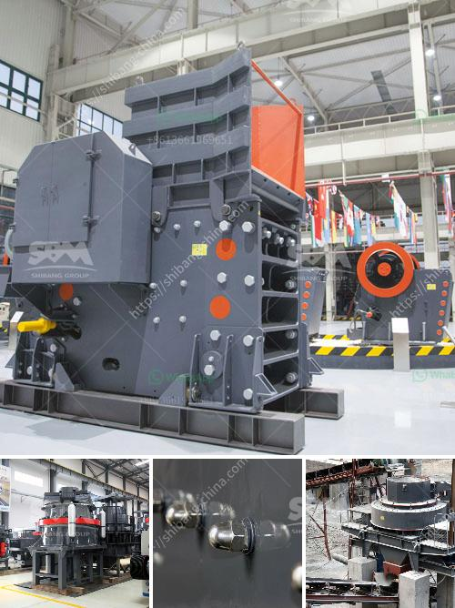

<h3>gold conveyor belts south africa</h3>
South Africa has long been renowned for its rich reserves of gold, making it one of the leading gold producers in the world. As the demand for gold continues to rise, mining companies are finding innovative ways to extract this valuable metal. One such method is the utilization of gold conveyor belts.

Conveyor belts are used in various industries for transporting materials and products efficiently and quickly. In the mining industry, conveyor belts play a crucial role in transporting raw materials, including gold, from the mines to processing plants or storage facilities. South Africa, with its abundant gold reserves, has become a hub for gold mining activities, and the need for efficient conveyor systems has grown exponentially.

The gold conveyor belts in South Africa are specifically designed to handle the unique demands of gold mining operations. These belts are made with specialized materials that can withstand harsh conditions such as extreme temperatures, high abrasion, and heavy loads. They are also resistant to chemicals and oils that are commonly used in the mining industry.

One key advantage of using gold conveyor belts is their ability to transport large quantities of ore in a short amount of time. Traditional methods of transportation, such as trucks or loaders, can be time-consuming and require additional manpower. Conveyor systems eliminate the need for manual labor, increasing efficiency and reducing operational costs.

Moreover, gold conveyor belts have safety features that enhance worker protection. These belts are equipped with advanced sensors and control systems that ensure smooth operation and prevent accidents. They can detect blockages or malfunctions and automatically stop the conveyor, avoiding potential hazards. Additionally, conveyor belts reduce the risk of manual handling injuries that can occur when moving heavy materials.

In recent years, South Africa has witnessed the development of advanced technologies that have further enhanced the efficiency of gold conveyor belts. Automated systems allow for remote monitoring and control of conveyor operations, reducing the need for on-site personnel. These technological advancements increase productivity, reduce downtime, and optimize overall operations.

Gold conveyor belts have not only revolutionized the mining industry in South Africa but have also had a significant impact on the country's economy. The gold mining sector is a major contributor to South Africa's GDP and job creation. By adopting efficient conveyor systems, mining companies can increase their production capacity, meet global demands, and boost economic growth.

However, it is important to note that while gold conveyor belts offer numerous benefits, their implementation needs to be environmentally sustainable. Mining activities can have adverse effects on the environment, such as deforestation, soil erosion, and water pollution. It is crucial for mining companies to adopt responsible mining practices and invest in technologies that minimize environmental impact.

In conclusion, gold conveyor belts have become vital components of the gold mining industry in South Africa. Their ability to transport large quantities of ore efficiently, enhance safety measures, and improve operational efficiency makes them indispensable. As the demand for gold continues to rise, it is imperative for mining companies to invest in advanced conveyor systems to unlock the golden potential of South Africa's precious metal reserves.
<h3>Contact us</h3><ul><li><strong>Whatsapp:&nbsp;<a href="https://wa.me/8613661969651">+8613661969651</a></strong></li><li><a href="https://swt.shibang-china.com/?git&amp;zhl&amp;gold conveyor belts south africa"><strong>Online Service(chat now)</strong></a></li></ul><h3>Related</h3><ul><li><a href='complete mobile stone crushing machine 30th.md'>complete mobile stone crushing machine 30th</a></li><li><a href='kaolin clay crusher manufacturing process.md'>kaolin clay crusher manufacturing process</a></li><li><a href='grinding media balls suppliers in south africa.md'>grinding media balls suppliers in south africa</a></li><li><a href='crusher plant for coal for sale in south africa.md'>crusher plant for coal for sale in south africa</a></li><li><a href='impact crusher plant for sale.md'>impact crusher plant for sale</a></li></ul>