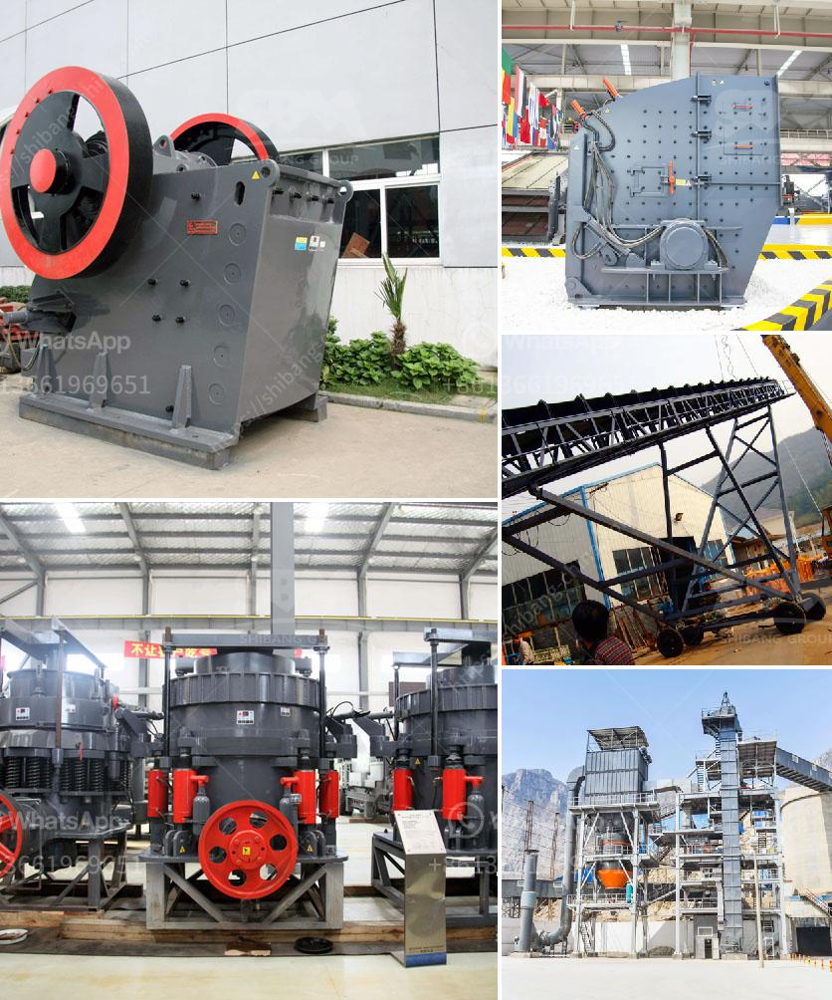

<h3>gold crusher for sale in china</h3>
Gold Crusher For Sale in China – A Perfect Combination of High Efficiency and Low Energy Consumption

As we all know, gold-bearing rocks are very hard, so it takes a longer time and needs more crushing equipment to deal with gold-bearing rocks. It will produce more wear-resistant materials during the processing of mineral resources. With the continuous development of mineral resources crushing technology, the type and performance of crushers are also constantly evolving. The crusher has become an indispensable equipment in the process of gold crushing.

The gold ore crushing process is mainly used in gold-bearing rocks. It uses jaw crusher for primary crushing, then cone crusher for secondary crushing, and finally grinding mill to make gold particles. Jaw crusher crushes gold rocks into small pieces, then cone crusher crushes these small pieces into particles less than 2cm in diameter. The final step is grinding mill. We often use ball mill as grinder to grind gold ore into powder.

Gold Crusher For Sale In China has strong power to crush hard rocks because of the advanced technology. The output particle size can be adjusted in the range of 3mm-50mm. It can eliminate the obstacles caused by material, environment, and configuration, and provide customers with efficient and low-cost crushing equipment.

In addition, the Gold Crusher For Sale In China has the advantages of high crushing efficiency, low energy consumption, adjustable product size, and simplified process flow. It has the characteristics of large crushing ratio, stable performance, simple structure, and convenient maintenance. The wear parts are made of high-quality wear-resistant materials, which greatly reduces the wear and tear of the equipment and prolongs the service life of the equipment.

In summary, the Gold Crusher For Sale In China has the advantages of high efficiency, low energy consumption, reliable operation, and easy installation. It is an ideal sand and stone production line and is widely used in mining, metallurgy, building materials, highways, railways, water conservancy, and other industries. Gold crusher for sale in China not only can be used for crushing various hardness of ore, but also can be widely used in mining, chemical, cement, construction, refractory materials and ceramics industries and so on.
<h3>Contact us</h3><ul><li><strong>Whatsapp:&nbsp;<a href="https://wa.me/8613661969651">+8613661969651</a></strong></li><li><a href="https://swt.shibang-china.com/?git&amp;zhl&amp;gold crusher for sale in china"><strong>Online Service(chat now)</strong></a></li></ul><h3>Related</h3><ul><li><a href='used rock crushing plant for sale in uae.md'>used rock crushing plant for sale in uae</a></li><li><a href='basalt crusher machine.md'>basalt crusher machine</a></li><li><a href='brick factory for sale in uk.md'>brick factory for sale in uk</a></li><li><a href='manufacture of a cone crusher.md'>manufacture of a cone crusher</a></li><li><a href='hammer mills price.md'>hammer mills price</a></li></ul>