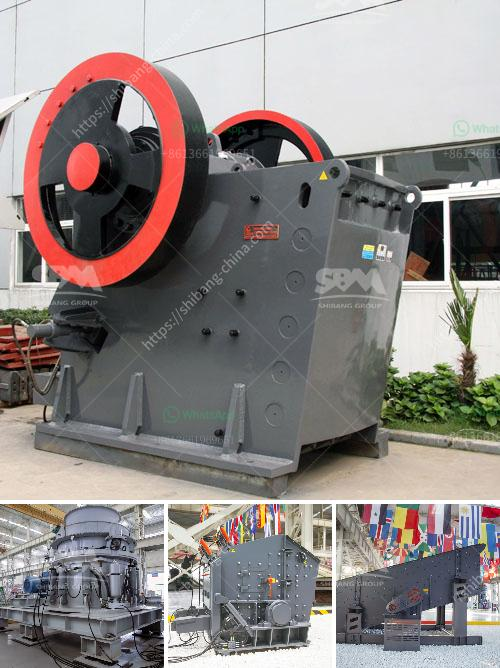

<h3>gold hammer crusher</h3>
The gold hammer crusher is an indispensable equipment in the gold ore crushing process and traditional hammer crushers are mostly used in gold mining sites. As the industry grows, so does the demand for higher capacity, efficient and durable hammer crushers. This makes it essential for any gold mining company to invest in equipment that can handle large amounts of material without breakage or downtime. The gold hammer crusher is a reliable choice that delivers on all fronts.

One of the main advantages of the gold hammer crusher is its ability to produce a fine, uniform particle size. This is particularly important for ore processing, as it ensures that the gold can be efficiently liberated from the gangue minerals and recovered by subsequent processing steps such as gravity separation or flotation. The finely crushed material also increases the surface area of the ore, making it easier for chemicals to react and extract the gold. This leads to higher gold recovery rates and increased profitability for the mining operation.

Another advantage of the gold hammer crusher is its durability. Gold ore is often accompanied by hard, abrasive rocks that can cause wear and tear on equipment. The gold hammer crusher is built to withstand such demanding conditions and continue to perform reliably for many years. Its robust construction includes hardened steel hammers and a heavy-duty rotor, designed to withstand the impact of the rocks and maintain its performance even under heavy loads.

In addition to its durability, the gold hammer crusher is also incredibly efficient in terms of energy consumption. Its unique design, combined with the high-speed rotation of the hammers, allows for a rapid reduction in size of the ore particles. This means that less energy is required to crush the same amount of material compared to other crushers, resulting in significant cost savings for the mine.

Furthermore, the gold hammer crusher is also easy to maintain. It features a simple structure, with few moving parts, making it less prone to mechanical failures. This reduces maintenance costs and downtime, allowing the mining operation to focus on what it does best – extracting gold.

Overall, the gold hammer crusher is a reliable choice for any gold mining company looking to improve its mineral processing operations. With its high capacity, fine particle size reduction, durability, and low energy consumption, it delivers on all fronts. Furthermore, its ease of maintenance ensures that it will continue to perform reliably for years to come. The gold hammer crusher is truly a valuable asset in any gold mining operation.

In conclusion, the gold hammer crusher is a versatile and reliable equipment for gold ore processing. Its numerous advantages make it a preferred choice among gold mining companies. Whether your operation is small-scale or large-scale, investing in a gold hammer crusher can greatly enhance your processing efficiency and maximize gold recovery. So, why wait? Equip your operation with a gold hammer crusher and watch your profits soar!
<h3>Contact us</h3><ul><li><strong>Whatsapp:&nbsp;<a href="https://wa.me/8613661969651">+8613661969651</a></strong></li><li><a href="https://swt.shibang-china.com/?git&amp;zhl&amp;gold hammer crusher"><strong>Online Service(chat now)</strong></a></li></ul><h3>Related</h3><ul><li><a href='jaw industry limestone process in malaysia.md'>jaw industry limestone process in malaysia</a></li><li><a href='crusher mill sales in malaysia.md'>crusher mill sales in malaysia</a></li><li><a href='list of manufacturers vertical milling machines in europe.md'>list of manufacturers vertical milling machines in europe</a></li><li><a href='jaw crusher pe 150x250.md'>jaw crusher pe 150x250</a></li><li><a href='coal dryer manufacturer india.md'>coal dryer manufacturer india</a></li></ul>