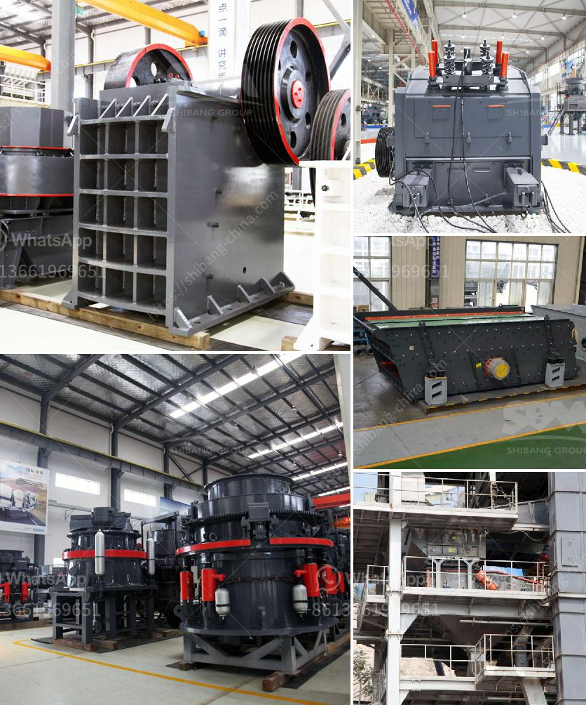

<h3>gold milling machine for sale in south africa</h3>
Gold milling machine for sale in South Africa is a hot topic in the mining industry. With the wide application of gold ores, the gold milling machine is also widely used in milling various ores and other materials. There are also many small scale gold milling equipment for sale. According to different requirements, the scale of the gold milling machine can range from a few tons to hundreds of tons, ranging from small size grinding equipment to large scale milling equipment.

The gold milling machine consists of a cylindrical drum, sometimes tapered at one end, and usually has a charge of steel balls ranging in size up to 125mm for larger mills. Product size can be as small as 0.005mm, but product size is dependant upon the time the charge spends in the grinding zone and therefore the reduction rate is a function of the throughput. A roughing mill will have less capacity than a finishing mill and hence the wire rod mill will process fewer tonnes per hour.

Gold milling machine for sale includes both closed circuit and open circuit grinding process. It is used to grind materials in the beneficiation process and can be applied to grind an array of ores and other materials block or granular materials. There are also rotary drum scrubbers for sale. These scrubbers are suited to the most arduous conditions encountered in the South African Mining and Quarrying Industries.

Gold milling machine for sale in South Africa mainly includes: gold ball mill, gold Raymond mill, and gold vertical roller mill. Gold ball mill is one of the most commonly used grinding equipment in the beneficiation process, usually used for the treatment of gold ore with high grinding fineness. In addition, the gold ball mill can also be used in the grinding of mineral processing plants to grind various ores and other materials. The gold Raymond mill is a universal mining machine, and the blower plays an important role in the grinding process. The gold vertical roller mill is the roller mill that uses the grinding tools to grind the material. The vertical roller mill is designed to grind materials with high grinding fineness.

In summary, the gold milling machine’s performance and capacity will be greatly improved by optimizing the above parts. With the continuous improvement of science and technology, the gold milling machine for sale in South Africa will bring more economic benefits to customers. It is worth noting that the gold mill must always pay attention to replace the liner regularly to avoid damage to the grinding body. At the same time, operators should supervise the operation of the mill, so as to prevent the blast furnace tube explosion accident caused by treatment.

In conclusion, gold milling machine for sale in South Africa is a well-known ball mill machine manufacturer and supplier. Its main components include feeding device, discharge device, rotating device, transmission device (gear box, pinion gear) and electric control part. The ball mill produced by our company has a wide range of applications and can be used for grinding and processing of various ores and materials. With the continuous development and advancement of technology, the gold milling machine will usher in a broader market prospect in the future.
<h3>Contact us</h3><ul><li><strong>Whatsapp:&nbsp;<a href="https://wa.me/8613661969651">+8613661969651</a></strong></li><li><a href="https://swt.shibang-china.com/?git&amp;zhl&amp;gold milling machine for sale in south africa"><strong>Online Service(chat now)</strong></a></li></ul><h3>Related</h3><ul><li><a href='crusher machine vendor in penang.md'>crusher machine vendor in penang</a></li><li><a href='raymond mill china.md'>raymond mill china</a></li><li><a href='brick stone crusher machine.md'>brick stone crusher machine</a></li><li><a href='stone crushers in cali.md'>stone crushers in cali</a></li><li><a href='hammer mill nigeria.md'>hammer mill nigeria</a></li></ul>