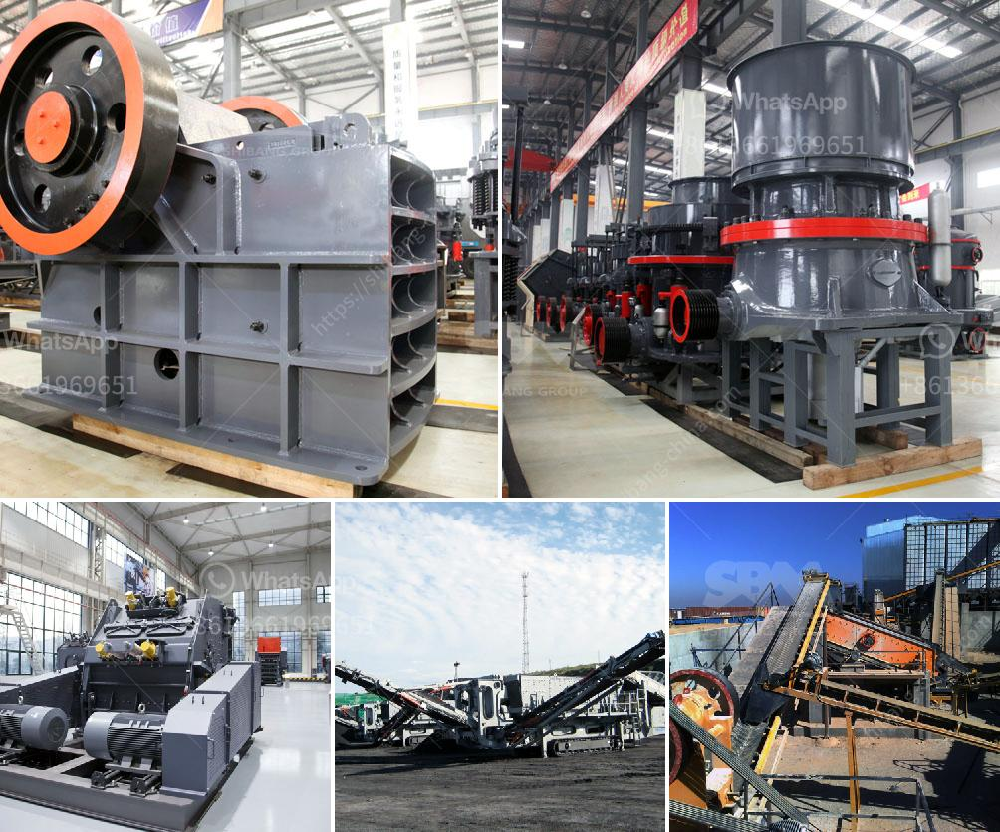

<h3>gold milling plant cost</h3>
Gold milling plant cost is a crucial factor in the success of any mining operation. The mining industry has always been capital-intensive, with a heavy focus on equipment and machinery. However, the advent of new technologies has made it easier for mine operators to reduce costs and improve overall efficiency.

The cost of establishing a gold milling plant depends on several factors, including the scale of the operation, the type of machinery and equipment required, and the geographic location of the mine. In general, larger-scale operations have higher upfront costs due to the need for more extensive infrastructure and machinery. However, these larger operations also benefit from economies of scale, leading to lower operational costs in the long run.

The type of machinery and equipment required for a gold milling plant can vary depending on several factors, such as the type of ore being processed, the desired purity of the final product, and the specific site conditions. Common equipment used in a gold milling plant includes crushers, grinding mills, flotation machines, and cyanide leaching tanks. These machines are essential for extracting gold from the ore and processing it into a marketable product.

Another important factor influencing gold milling plant costs is the geographic location of the mine. Mines located in remote areas often have higher costs due to the need for more extensive infrastructure, transportation, and logistical challenges. In contrast, mines located in more accessible regions may benefit from lower costs, as they can take advantage of existing infrastructure and a readily available labor force.

One major development that has helped reduce gold milling plant costs is the adoption of advanced technologies. For example, the use of automated equipment and robotics in the milling process has significantly increased efficiency and productivity, while reducing labor costs. Additionally, advancements in ore sorting technologies have allowed mine operators to separate valuable ores from waste material before the milling process. This not only improves the overall recovery rate of gold but also reduces the amount of material that needs to be processed, resulting in cost savings.

Furthermore, advancements in energy-efficient technologies have also contributed to cost reductions in gold milling plants. The milling process requires a significant amount of energy to crush and grind the ore, making energy costs a considerable expense for mine operators. However, the use of energy-efficient equipment, such as high-pressure grinding rolls and vertical mills, can help reduce energy consumption and, subsequently, operational costs.

In conclusion, gold milling plant costs play a crucial role in the viability and profitability of mining operations. The scale of the operation, the type of machinery and equipment required, and the geographic location of the mine all contribute to the overall cost. However, advancements in technology, such as automated equipment, ore sorting technologies, and energy-efficient machinery, have helped reduce costs and improve operational efficiency. These advancements, coupled with prudent planning and cost-effective strategies, can help mine operators establish a successful and profitable gold milling plant.
<h3>Contact us</h3><ul><li><strong>Whatsapp:&nbsp;<a href="https://wa.me/8613661969651">+8613661969651</a></strong></li><li><a href="https://swt.shibang-china.com/?git&amp;zhl&amp;gold milling plant cost"><strong>Online Service(chat now)</strong></a></li></ul><h3>Related</h3><ul><li><a href='coal mill outlet temperature.md'>coal mill outlet temperature</a></li><li><a href='quartz plass grinder price.md'>quartz plass grinder price</a></li><li><a href='conveyor belt structure design.md'>conveyor belt structure design</a></li><li><a href='used rock crusher dealers in usa.md'>used rock crusher dealers in usa</a></li><li><a href='stone crusher machine in india.md'>stone crusher machine in india</a></li></ul>