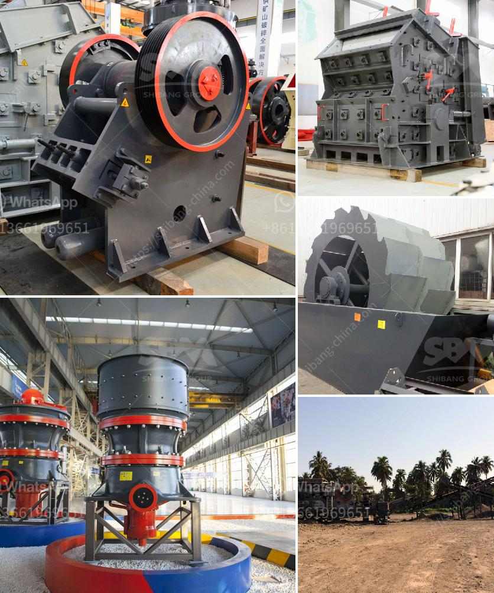

<h3>gold mining business plan ghana</h3>
Gold is a valuable commodity and Ghana is blessed with an abundant supply of it. Now more than ever, the government is making a conscious effort to promote sustainable gold mining in Ghana. The Ghanaian government is also taking steps to improve the governance of the mining sector, promote transparency, and ensure that the country maximizes the benefits from gold mining.

With these developments, there are numerous business opportunities for investors in the gold mining sector. In this article, we will discuss a business plan for gold mining for investors looking to start their own gold mining operations in Ghana.

The gold mining sector is an important aspect of Ghana’s economy and for many years, the government has encouraged foreign investment in the sector. This has been primarily focused on promoting the use of modern technologies in the sector, as well as ensuring that all activities are conducted in a sustainable and environmentally friendly manner.

Ghana's government requires that all miners obtain a license to operate. The process involves obtaining the necessary mining license from the Minerals Commission, which is responsible for granting mining rights, as well as the Environmental Protection Agency (EPA), which ensures compliance with environmental regulations.

To commence mining operations, a considerable investment will be required to acquire machinery and equipment. You will need excavators, crushers, wash plants, trucks, and other heavy-duty machinery to carry out the operation efficiently.

Having skilled and experienced personnel is vital for a successful gold mining operation. You will need geologists, engineers, operators, and other professionals who are well-versed in the industry. Additionally, you will need administrative staff to handle the day-to-day operations of the business.

Safety should be a priority in any mining operation. It is essential to have proper safety measures in place to protect workers and visitors. Additionally, adhering to environmentally responsible practices is crucial to minimize the negative impact of mining activities on the environment.

Building positive relationships with local communities is essential to the success of a gold mining operation. Engaging with community leaders, providing employment opportunities, and contributing to community development are ways to ensure that the operation is welcomed by the community.

A comprehensive financial plan is crucial for the success of any business, including gold mining. You will need to consider factors such as the cost of machinery and equipment, operational expenses, salaries, taxes, and potential fluctuations in gold prices. It is essential to conduct a detailed feasibility study to ascertain the financial viability of the business.

In conclusion, starting a gold mining business in Ghana requires a significant investment in terms of time, resources, and funding. However, with the right business plan and proper execution, gold mining can be a lucrative venture for individuals willing to take the risk. Ghana's abundant gold reserves, coupled with the government's commitment to promoting sustainable mining practices, make it an attractive destination for investors looking to engage in gold mining.
<h3>Contact us</h3><ul><li><strong>Whatsapp:&nbsp;<a href="https://wa.me/8613661969651">+8613661969651</a></strong></li><li><a href="https://swt.shibang-china.com/?git&amp;zhl&amp;gold mining business plan ghana"><strong>Online Service(chat now)</strong></a></li></ul><h3>Related</h3><ul><li><a href='gold hammer crusher.md'>gold hammer crusher</a></li><li><a href='nigeria coal making process.md'>nigeria coal making process</a></li><li><a href='chilli powder making machine india price.md'>chilli powder making machine india price</a></li><li><a href='roller stone crusher.md'>roller stone crusher</a></li><li><a href='calcining machine for gypsum factory from taiwan.md'>calcining machine for gypsum factory from taiwan</a></li></ul>