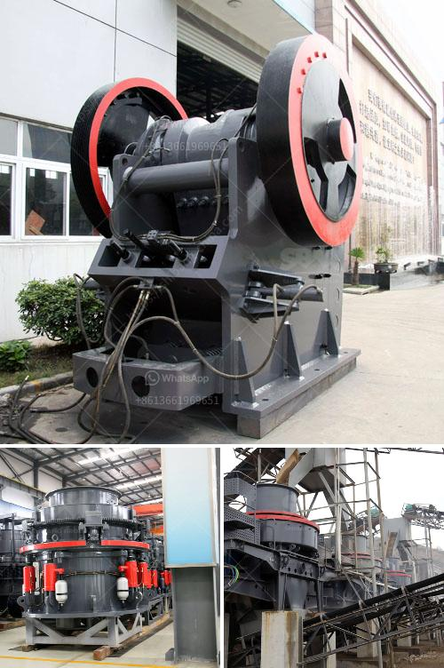

<h3>gold mining compressor price in south africa</h3>
Gold mining in South Africa has a turbulent history with wars, disputes, and economic fluctuations shaping the sector's fortunes over the years. But the industry has always played a major role in the country's economy. One essential equipment used in gold mining is the air compressor. Compressors are designed to provide reliable and efficient compressed air supply to power various tools and equipment used in the mining process.

When it comes to gold mining, the importance of a high-quality, reliable, and durable compressor cannot be overstated. Compressors are essential for drilling, blasting, ventilation systems, and even powering pneumatic tools. Therefore, finding a reliable compressor at a reasonable price is crucial for mining companies in South Africa.

The prices of compressors vary greatly depending on their size, specifications, and efficiency. In South Africa, mining companies may opt for refurbished compressors rather than new ones due to budget constraints. Refurbished compressors are cheaper, but they still need to meet certain quality standards to ensure their reliability and performance.

However, it is worth noting that the price of a compressor is not the only factor to consider. Companies must consider the total cost of ownership, including maintenance, energy consumption, and after-sales support. Investing in a high-quality compressor may initially seem expensive, but it can save mining companies a significant amount of money in the long run.

In South Africa, prices for compressors can range from ZAR 10,000 to ZAR 500,000 or more. The price depends on various factors such as the brand, model, capacity, and features. It is recommended for mining companies to consult with reputable compressor suppliers who can offer expert advice and provide tailored solutions based on the specific needs of the project.

In conclusion, gold mining in South Africa requires the use of reliable and efficient compressors. While the price range of compressors in the market is broad, it is crucial for mining companies to prioritize quality and durability over cost. A high-quality compressor may have a higher initial price but can lead to long-term savings and improved productivity. Choosing the right compressor supplier can help mining companies navigate the options and make an informed decision.
<h3>Contact us</h3><ul><li><strong>Whatsapp:&nbsp;<a href="https://wa.me/8613661969651">+8613661969651</a></strong></li><li><a href="https://swt.shibang-china.com/?git&amp;zhl&amp;gold mining compressor price in south africa"><strong>Online Service(chat now)</strong></a></li></ul><h3>Related</h3><ul><li><a href='crusher machine price in pakistan.md'>crusher machine price in pakistan</a></li><li><a href='cement plant price in pakistan.md'>cement plant price in pakistan</a></li><li><a href='equipment for the production of vermiculite.md'>equipment for the production of vermiculite</a></li><li><a href='kaolin grinding mill.md'>kaolin grinding mill</a></li><li><a href='jaw crusher price in kenya.md'>jaw crusher price in kenya</a></li></ul>