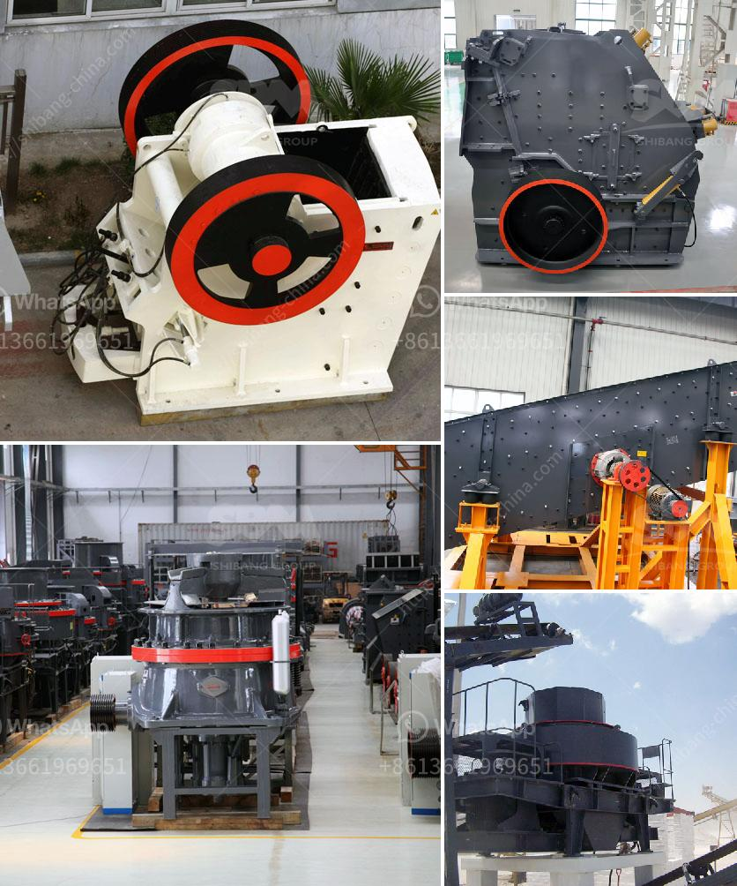

<h3>gold mining crushing and processing plant price</h3>
Gold mining refers to the extraction of gold from underground mines or riverbeds. It is one of the most important industrial activities across the globe due to its significant contribution to the world's economy. However, this process requires the use of various machinery and equipment to extract gold from ores. One crucial piece of equipment in this process is the gold mining crushing and processing plant.

The gold mining crushing and processing plant is a 24-hour operation that features a five-stage crushing and screening circuit. The first stage is the primary crushing stage, where large rocks are crushed into smaller pieces. This is achieved by using a large gyratory crusher or a jaw crusher. The crushed ore is then transported to the next stage using conveyors or trucks.

In the second stage, the ore is further reduced in size through secondary and tertiary crushing. These stages involve using cone crushers, impact crushers, or vertical shaft impact crushers. The crushed ore is then screened into various sizes, allowing for the separation of gold from other minerals. The screening process is important as it ensures that only the gold-bearing ore is further processed.

After screening, the crushed ore is sent to the grinding circuit, where it is finely ground into a powder. This step is crucial as it increases the surface area of the ore, making it easier for the gold to be dissolved during the subsequent cyanide leaching process. The grinding circuit typically consists of a ball mill, which is a rotating cylinder filled with steel balls that crush and grind the ore. The finely ground ore is then mixed with water and chemicals, such as lime and cyanide, to create a slurry.

The slurry is then processed in the leaching circuit, which consists of multiple tanks or vats. In these tanks, the gold is dissolved from the ore by the cyanide solution. This process is known as cyanide leaching. The gold-bearing solution is then separated from the remaining solids, commonly known as tailings, through a series of thickening and filtration stages. The gold is then recovered from the solution by adsorption onto activated carbon or by precipitation with zinc dust.

The cost of a gold mining crushing and processing plant varies depending on factors such as the size, capacity, and level of automation. A small-scale plant with a capacity of around 50 tonnes per day can be purchased for approximately $150,000. Larger scale plants with capacities ranging from 500 to 5,000 tonnes per day can cost upward of $10 million. Furthermore, the price of the plant can also be affected by geographical location, availability of equipment, and local labor costs.

Despite the initial investment, a well-designed and efficient gold mining crushing and processing plant can yield significant returns. The gold extracted from the ore can be sold or used for various purposes, including jewelry, electronics, and investment. Additionally, the plant can also generate employment opportunities, stimulate local economies, and contribute to sustainable development practices.

In conclusion, the gold mining crushing and processing plant plays a crucial role in the gold extraction process. It utilizes various stages of crushing, grinding, and leaching to extract and recover gold from underground mines or riverbeds. Despite the initial investment, the plant offers a promising return on investment and supports local economies. Therefore, it is imperative to choose the right equipment and ensure efficient operations to achieve optimal results.
<h3>Contact us</h3><ul><li><strong>Whatsapp:&nbsp;<a href="https://wa.me/8613661969651">+8613661969651</a></strong></li><li><a href="https://swt.shibang-china.com/?git&amp;zhl&amp;gold mining crushing and processing plant price"><strong>Online Service(chat now)</strong></a></li></ul><h3>Related</h3><ul><li><a href='machine to crush limestone in south africa.md'>machine to crush limestone in south africa</a></li><li><a href='crushing plant price list.md'>crushing plant price list</a></li><li><a href='price of artificial sand mill.md'>price of artificial sand mill</a></li><li><a href='quartz stone processing machines.md'>quartz stone processing machines</a></li><li><a href='lokomo jaw crusher.md'>lokomo jaw crusher</a></li></ul>