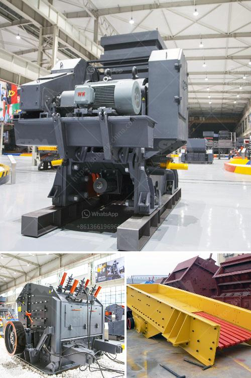

<h3>gold mining equipment company in japan</h3>
Japan, known for its technological advancements and innovation, has made significant strides in the gold mining equipment industry. As the demand for gold continues to surge globally, a handful of Japanese companies have entered the market, offering cutting-edge equipment and upholding the nation's reputation for excellence in engineering. This article will delve into the gold mining equipment company landscape in Japan, showcasing their contributions to the industry.

   Kobelco Construction Machinery, a renowned Japanese heavy equipment manufacturer, expanded its product portfolio in 2016 with the acquisition of Aichi Corporation, a domestic company specializing in aerial work platforms. Leveraging their expertise, Kobelco introduced innovative gold mining equipment tailored specifically for small to medium-scale operations. Their product range includes excavators, loaders, bulldozers, and crushing machines, precisely engineered to maximize efficiency and minimize environmental impact.

   Hitachi Construction Machinery is another prominent player in Japan's gold mining equipment industry. With a dedicated focus on customer satisfaction and technological excellence, Hitachi offers a wide array of mining equipment, including hydraulic excavators, dump trucks, wheel loaders, and crushers. Their state-of-the-art machinery ensures high productivity while adhering to stringent safety standards, contributing to the overall growth of gold mining operations in Japan.

   Komatsu, a household name in the global construction and mining equipment industry, has a dominant presence in Japan's gold mining equipment sector. Known for its reliability and durability, Komatsu's wide range of machinery encompasses hydraulic excavators, dump trucks, and drilling rigs, designed to withstand challenging mining conditions. With a strong focus on fuel efficiency and reduced emissions, the company actively prioritizes sustainability in its machines.

   Sumitomo Metal Mining is a leading Japanese company engaged in the exploration, mining, and smelting of various minerals, including gold. With decades of experience, the company not only provides high-quality mining equipment but also offers comprehensive solutions and technical support to budding gold mining enterprises. Leveraging their extensive knowledge, Sumitomo Metal Mining assists in optimizing mining processes, refining techniques, and resource management.

Japan's gold mining equipment manufacturers continue to innovate, constantly pushing the envelope to enhance efficiency, minimize environmental impact, and improve productivity. Rapid developments in automation, robotics, and remote-controlled machinery are reshaping the industry, enabling safer and more efficient extraction processes.

Additionally, growing environmental concerns have led Japanese companies to focus on sustainable mining practices. Through the incorporation of advanced technologies like electric-powered machines and hybrid fuel systems, the industry is striving to reduce emissions, conserve energy, and minimize the overall ecological footprint.

Japan's gold mining equipment companies are playing a pivotal role in providing advanced solutions to the global gold mining industry. With their technological expertise and commitment to sustainable practices, these companies are positioning Japan as a major player in the gold mining equipment market. As the demand for gold continues to rise, their innovative equipment will undoubtedly contribute to the exploration and extraction of this precious metal worldwide.
<h3>Contact us</h3><ul><li><strong>Whatsapp:&nbsp;<a href="https://wa.me/8613661969651">+8613661969651</a></strong></li><li><a href="https://swt.shibang-china.com/?git&amp;zhl&amp;gold mining equipment company in japan"><strong>Online Service(chat now)</strong></a></li></ul><h3>Related</h3><ul><li><a href='business plan of processing of calcium carbonate.md'>business plan of processing of calcium carbonate</a></li><li><a href='crushing and serreing machinery.md'>crushing and serreing machinery</a></li><li><a href='coal grinding plant.md'>coal grinding plant</a></li><li><a href='gold processing per hour.md'>gold processing per hour</a></li><li><a href='scrap prices per ton in south africa.md'>scrap prices per ton in south africa</a></li></ul>