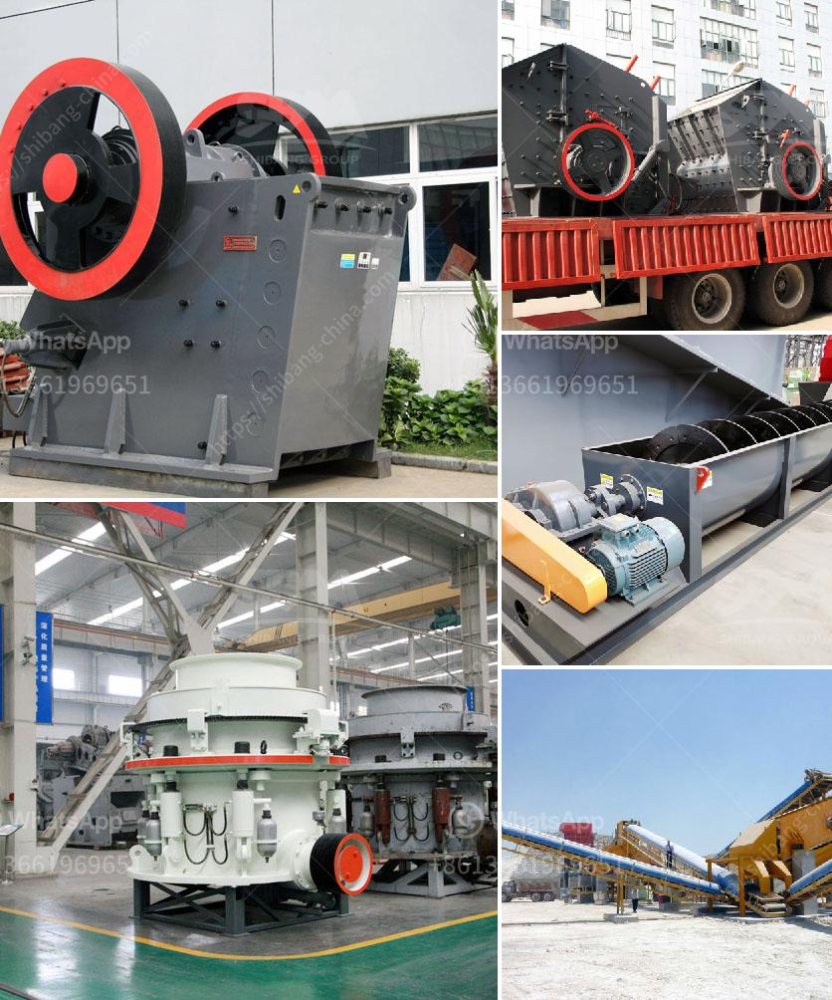

<h3>gold mining equipment in uae</h3>
Gold has been mined in various parts of the world for centuries, and the UAE is no exception. Historically, the Emirate of Fujairah was utilized as a strategic location for gold mining. With its proximity to the Indian Ocean and access to international trade routes, Fujairah has long been a center for trade and commerce, including gold mining.

Gold mining in the UAE has seen tremendous growth in recent years and this is not surprising as the nation is rich with gold reserves. Dubai Police have revealed that a significant amount of gold is being smuggled out of the UAE each year and are taking strict measures to ensure this does not happen in the future.

To support the growing demand for gold mining equipment, the UAE's gold mining industry has identified the need for an independent trading hub that provides proper infrastructure and resources for companies involved in gold mining, refining and trading.

The UAE free trade zones provide a developed infrastructure and communication network, making them ideal locations to connect with other global gold mining companies. Companies can avail of various free zone benefits such as 100% foreign ownership, zero taxes on corporate profits, and excellent logistical support.

Gold mining equipment like excavators, trucks, and on-site processing units have revolutionized the industry by enabling operations to be conducted on a larger scale. When combined with automation, electronic tracking systems, and powerful generators, the mining process becomes highly efficient, yielding higher returns on investment.

One of the leading suppliers of gold mining and refining equipment in the UAE is ANBI Group. Established in 1992, ANBI Group has over two decades of experience in providing high-quality equipment and machinery for gold mining operations. They offer a wide range of products including excavators, loaders, drilling machines, crushers, and more.

In conclusion, the UAE's gold mining industry is thriving due to the nation's rich gold reserves, strategic location, and favorable business environment. With the availability of top-notch equipment and dedicated trading hubs like the free zones, gold mining companies in the UAE are well-positioned to contribute to the growth of the global gold industry.
<h3>Contact us</h3><ul><li><strong>Whatsapp:&nbsp;<a href="https://wa.me/8613661969651">+8613661969651</a></strong></li><li><a href="https://swt.shibang-china.com/?git&amp;zhl&amp;gold mining equipment in uae"><strong>Online Service(chat now)</strong></a></li></ul><h3>Related</h3><ul><li><a href='grinding roller mill machine.md'>grinding roller mill machine</a></li><li><a href='calcium carbonate factory costs.md'>calcium carbonate factory costs</a></li><li><a href='crusher price for crushed stone.md'>crusher price for crushed stone</a></li><li><a href='material ball mills.md'>material ball mills</a></li><li><a href='production process of limestone.md'>production process of limestone</a></li></ul>