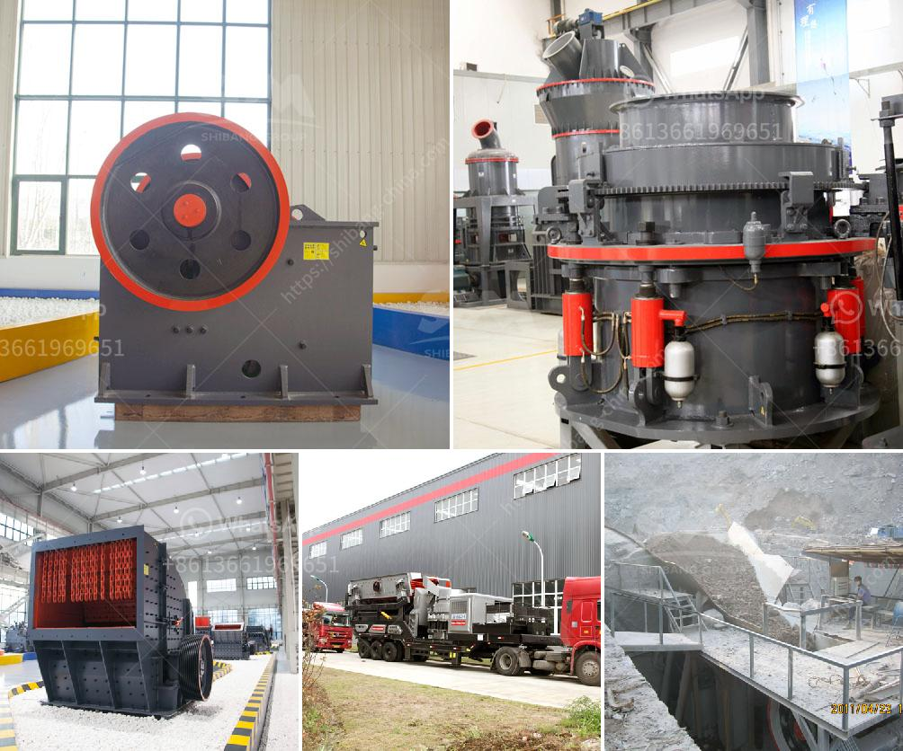

<h3>gold mining equipment manufacturer china</h3>
Gold mining has been a crucial part of China's economic development and growth since the late 1970s. This thriving industry has significantly contributed to the country's overall wealth and has provided numerous job opportunities for its citizens. One of the key factors behind China's success in gold mining is its strong manufacturing sector, particularly the gold mining equipment manufacturers.

China is the world's largest producer of gold, mining over 450 tons of gold annually. Their gold mining equipment has been exported to more than 100 countries, including Nigeria, Tanzania, South Africa, Ghana, Zimbabwe, Zambia, Guinea, and Pakistan. China has become one of the world's leading gold mining countries and has great potential for future development.

China's mining industry has played a crucial role in the country's economic growth, lifting millions of people out of poverty. It has created jobs and brought prosperity to remote areas, where gold is abundant. The Chinese government has recognized the importance of the mining industry and has invested heavily in infrastructure such as roads and railways to support the development of gold mines.

To meet the increasing demand for gold mining equipment, many Chinese manufacturers have expanded their production capacity and improved the quality of their products. China has a wealth of resources and a highly skilled workforce, making it the ideal location for manufacturing gold mining equipment. The cost of labor in China is significantly lower compared to other countries, allowing manufacturers to offer competitive prices to customers.

Chinese gold mining equipment manufacturers have established a strong presence worldwide. With a wide product range and excellent after-sales services, they have become the preferred choice of many mining companies around the world. Their equipment is known for its durability, reliability, and efficiency, which are crucial factors in the mining industry. In addition, Chinese manufacturers constantly invest in research and development to enhance their products' performance.

China's gold mining equipment manufacturers have also embraced environmental sustainability. They have made significant efforts to develop eco-friendly equipment that minimizes the impact on the environment. Many Chinese manufacturers adhere to strict environmental regulations and embark on initiatives to reduce carbon emissions and energy consumption during the manufacturing process.

The global demand for gold is expected to continue growing in the foreseeable future, which provides significant opportunities for Chinese gold mining equipment manufacturers. As more countries look to expand their gold mining operations, the demand for high-quality, reliable, and efficient equipment will increase. Chinese manufacturers are well-positioned to cater to this demand and play a crucial role in the industry's expansion.

In conclusion, China's gold mining equipment manufacturers have made significant contributions to the global gold mining industry. With their high-quality products, competitive prices, and commitment to sustainability, they have become global leaders in the sector. As the demand for gold continues to rise, Chinese manufacturers are well-equipped to meet the needs of mining companies worldwide.
<h3>Contact us</h3><ul><li><strong>Whatsapp:&nbsp;<a href="https://wa.me/8613661969651">+8613661969651</a></strong></li><li><a href="https://swt.shibang-china.com/?git&amp;zhl&amp;gold mining equipment manufacturer china"><strong>Online Service(chat now)</strong></a></li></ul><h3>Related</h3><ul><li><a href='dry process of cement manufacturing.md'>dry process of cement manufacturing</a></li><li><a href='calcium carbonate crushers.md'>calcium carbonate crushers</a></li><li><a href='grinding mill gold ore.md'>grinding mill gold ore</a></li><li><a href='quartz plass grinder price.md'>quartz plass grinder price</a></li><li><a href='how much is mobile crusher rock.md'>how much is mobile crusher rock</a></li></ul>