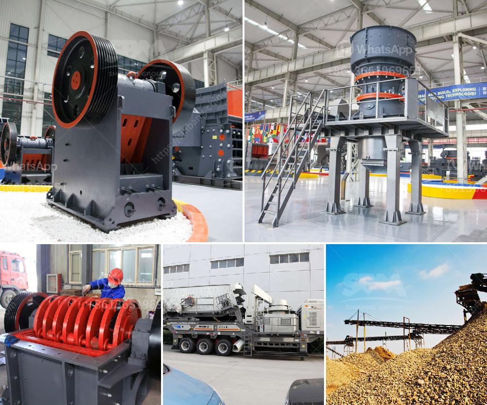

<h3>gold mining equipment manufacturers in europe</h3>
Gold has been a valuable resource for centuries. Today, it is still highly sought after and continues to be mined all over the world, including in Europe. European countries have a rich history of gold mining and an abundance of deposits to exploit. To effectively and efficiently extract this precious metal, gold mining equipment is necessary. In Europe, several manufacturers provide advanced and innovative machinery specifically designed for gold mining operations.

One such manufacturer is Xinhai Mining Technology & Equipment Inc., based in China but with a strong presence in Europe. Xinhai offers a wide range of machinery, including gold extraction equipment, gold concentrators, and gold separating machines. Their equipment is known for its durability, high efficiency, and low maintenance requirements, making it a popular choice among gold miners throughout Europe.

Another prominent manufacturer is Outotec, a Finnish company that provides various solutions for gold processing. Their equipment includes gold flotation machines, gold thickeners, and gold smelting furnaces. Outotec operates in multiple countries across Europe and has a strong reputation for delivering reliable and high-quality equipment.

Metso Corporation, headquartered in Finland, is yet another leading manufacturer of gold mining equipment in Europe. With decades of experience in the industry, they offer a comprehensive range of machinery for gold extraction, gold beneficiation, and gold refining. Metso's equipment is known for its advanced technology, precise engineering, and exceptional performance.

In addition to these manufacturers, there are also several smaller companies in Europe that specialize in producing gold mining equipment. These companies often offer niche products or specialize in particular aspects of gold mining, such as gold panning equipment or gold detectors.

Overall, Europe is home to a diverse range of gold mining equipment manufacturers. Whether a large corporation or a smaller specialist, these manufacturers provide the machinery necessary for extracting and processing gold efficiently and effectively. With their advanced technology and innovative solutions, these manufacturers play a crucial role in ensuring the continued success of gold mining in Europe.
<h3>Contact us</h3><ul><li><strong>Whatsapp:&nbsp;<a href="https://wa.me/8613661969651">+8613661969651</a></strong></li><li><a href="https://swt.shibang-china.com/?git&amp;zhl&amp;gold mining equipment manufacturers in europe"><strong>Online Service(chat now)</strong></a></li></ul><h3>Related</h3><ul><li><a href='copper powder making machine.md'>copper powder making machine</a></li><li><a href='crushing machine price in malaysia.md'>crushing machine price in malaysia</a></li><li><a href='double roller crusher advantages.md'>double roller crusher advantages</a></li><li><a href='sand screening machine philippines.md'>sand screening machine philippines</a></li><li><a href='coal crushing and washing plant sale south africa.md'>coal crushing and washing plant sale south africa</a></li></ul>