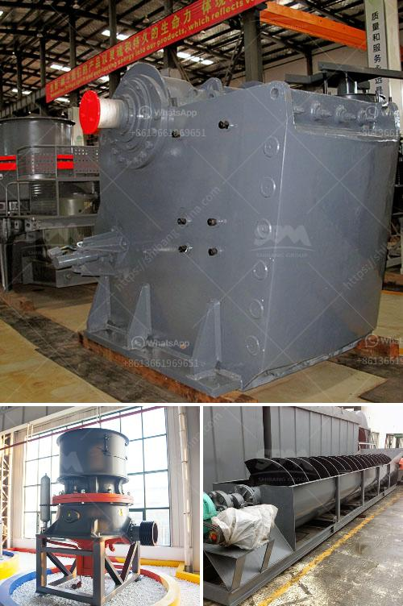

<h3>gold mining equipments africa</h3>
Gold mining has been a significant economic activity in Africa for centuries. The mineral-rich continent is home to some of the world's largest gold deposits, attracting investors and miners from around the globe. To extract this precious metal, gold mining equipment is essential. From crude tools used thousands of years ago to modern machinery and technology, the evolution of mining equipment has been crucial in boosting gold production in Africa.

Historically, gold mining in Africa relied on simple tools such as picks, shovels, and pans. Artisanal miners would use these basic instruments to sift through riverbeds or mine shallow underground veins. While this method was effective for small-scale operations, it limited the amount of gold extracted and required extensive manual labor.

As advancements in mining technology emerged, gold mining in Africa started to witness significant transformations. The Industrial Revolution of the 18th and 19th centuries marked a turning point in the progression of mining equipment. Steam-powered machinery replaced manual labor, allowing miners to reach greater depths and extract larger volumes of gold.

Today, the gold mining industry in Africa relies on a variety of sophisticated equipment designed to maximize efficiency and productivity. Let's explore some of the essential machines used in modern gold mining in Africa:

1. Excavators: These large machines are used to strip overburden and dig out the gold-bearing ores. They are designed to handle massive amounts of material quickly and efficiently.

2. Crushers and grinders: Once excavated, the gold-bearing ores need to be crushed into smaller pieces to facilitate further processing. Crushers and grinders are used to achieve this task, reducing the ore size to a more manageable form.

3. Conveyors: In modern-day gold mines, conveyors are used to transport the crushed ore from one processing stage to another. They can cover long distances and handle large volumes of material, making them indispensable in the mining process.

4. Wash plants: Used to wash gold-bearing material, wash plants separate the valuable particles from the non-valuable ones. They employ various mechanisms, including trommels, screens, and sluice boxes, to effectively recover the gold.

5. Jigs and shaking tables: These gravity-based separation machines assist in separating gold from other minerals, ensuring maximum recovery. Jigs and shaking tables utilize differences in specific gravity to sort the materials, allowing gold particles to settle on the table or tray.

6. Cyanide leaching systems: This method involves treating the crushed and ground ore with a dilute solution of sodium cyanide. The cyanide reacts with the gold to form a soluble compound, which can be further processed to recover the gold.

These are just a few examples of the modern gold mining equipment used in Africa. The continent's abundance of mineral wealth, coupled with advancements in technology, has enabled gold production to thrive. However, it is important to note that responsible mining practices, environmental considerations, and proper safety protocols should always accompany the use of these high-powered machines.

In conclusion, gold mining in Africa has come a long way, with the evolution of mining equipment playing a vital role. From ancient tools to state-of-the-art machinery, each advancement has contributed to increased gold production and improved resource extraction. As technology continues to advance, it is expected that gold mining equipment will continue to evolve, making the process more efficient and sustainable in the years to come.
<h3>Contact us</h3><ul><li><strong>Whatsapp:&nbsp;<a href="https://wa.me/8613661969651">+8613661969651</a></strong></li><li><a href="https://swt.shibang-china.com/?git&amp;zhl&amp;gold mining equipments africa"><strong>Online Service(chat now)</strong></a></li></ul><h3>Related</h3><ul><li><a href='mica powder mill malaysia.md'>mica powder mill malaysia</a></li><li><a href='stone crusher machine in russia.md'>stone crusher machine in russia</a></li><li><a href='feldspar crusher equipment.md'>feldspar crusher equipment</a></li><li><a href='slag crusher machine india.md'>slag crusher machine india</a></li><li><a href='portable jaw crusher in saudi.md'>portable jaw crusher in saudi</a></li></ul>