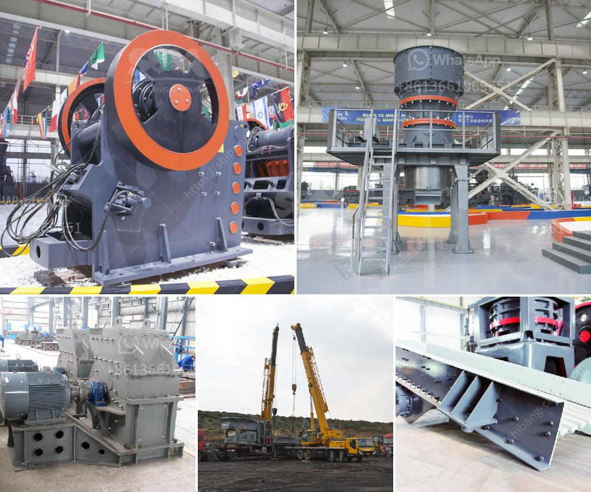

<h3>gold mining mercury</h3>
Gold mining is a lucrative industry that has flourished for centuries, attracting both large-scale companies and individual prospectors. However, the process of extracting gold often involves the use of toxic chemicals such as mercury, leaving a devastating impact on both the environment and human health.

Mercury is an integral part of the gold extraction process as it binds with gold particles, forming an amalgam that can be easily separated. This method, known as "mercury amalgamation," is widely practiced in small-scale gold mining operations, particularly in developing countries where regulations are less stringent.

The consequences of using mercury in gold mining are severe. Mercury, a potent neurotoxin, can cause various health issues, including damage to the central nervous system, kidney damage, and developmental deficits in children. Artisanal gold miners, who often lack protective equipment, are particularly vulnerable to the harmful effects of mercury exposure.

Moreover, mercury released during the gold mining process pollutes water bodies and ecosystems. When mercury reaches rivers, lakes, or oceans, it transforms into methylmercury, a highly toxic form that bioaccumulates in the food chain. This poses a significant threat to aquatic organisms, as well as to the communities that rely on these resources for their livelihoods.

Despite the well-documented negative impacts, the use of mercury in gold mining continues due to its efficiency and affordability. However, efforts are being made to introduce alternative, more environmentally friendly gold extraction methods. One such method is the use of cyanide, which has been controversial due to its own environmental and health risks.

In recent years, governments and international organizations have been working to curb mercury use in gold mining and promote safer practices. The Minamata Convention on Mercury, adopted in 2013, aims to reduce and ultimately eliminate the use of mercury in various industries, including gold mining. The convention encourages the adoption of alternatives and the promotion of best practices to mitigate the adverse effects of mercury.

In conclusion, gold mining has a dark side marked by the use of mercury, which not only poses a severe threat to human health but also harms the environment. It is crucial for governments, mining companies, and individuals to prioritize the adoption of safer, mercury-free gold extraction methods. By doing so, we can ensure a more sustainable future for both the mining industry and the ecosystems it impacts.
<h3>Contact us</h3><ul><li><strong>Whatsapp:&nbsp;<a href="https://wa.me/8613661969651">+8613661969651</a></strong></li><li><a href="https://swt.shibang-china.com/?git&amp;zhl&amp;gold mining mercury"><strong>Online Service(chat now)</strong></a></li></ul><h3>Related</h3><ul><li><a href='floatation method of analysis for silica sand.md'>floatation method of analysis for silica sand</a></li><li><a href='barite jaw crusher manufacturing companies.md'>barite jaw crusher manufacturing companies</a></li><li><a href='used ball mills philippines.md'>used ball mills philippines</a></li><li><a href='second hand equipment for sale in south africa.md'>second hand equipment for sale in south africa</a></li><li><a href='crushing plant for sale in tanzania.md'>crushing plant for sale in tanzania</a></li></ul>