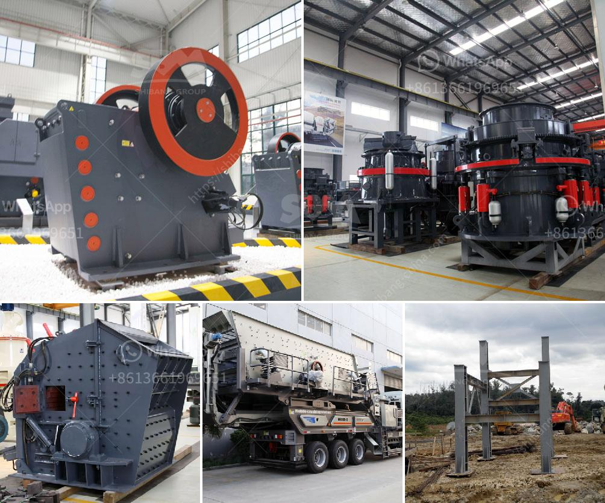

<h3>gold ore mining equipment companies in germany</h3>
Gold is a precious metal that has been valued by civilizations for centuries. It is used in various industries, including jewelry manufacturing, electronics, and dentistry. To obtain gold, mining companies need specialized equipment to extract and process the gold ore. In Germany, renowned mining equipment companies have emerged that are known for their innovative and efficient gold mining equipment.

One of the leading players in the gold mining equipment industry in Germany is Schönberg & Co. Founded in 1908, the company not only provides gold mining equipment but also excavators, screening plants, and stone crushers. Their extensive experience, combined with the latest technology, ensures high-quality equipment that increases productivity and minimizes downtime.

Schönberg & Co's gold mining equipment includes hydraulic excavators with powerful digging capabilities. These excavators have specially designed buckets to extract and transport ore efficiently. They also offer advanced screening plants that separate the ore from unwanted materials, such as rocks and soil, ensuring a higher purity of gold.

In addition to Schönberg & Co, another notable company in the gold ore mining equipment industry in Germany is Birnith Mining Machinery. This company has been catering to the mining industry's needs since 2002 and has gained a reputation for its reliable and durable equipment. Birnith offers a range of gold mining equipment, including jaw crushers, cone crushers, and ball mills, which are essential for crushing and grinding the ore.

Moreover, Birnith Mining Machinery's gold mining equipment also includes vibrating feeders, vibrating screens, and belt conveyors. These auxiliary equipment pieces help in smooth and efficient ore transportation and processing, ensuring a seamless gold mining operation.

Another noteworthy company in Germany's gold mining equipment industry is Sandvik Mining and Rock Technology. With a history dating back to 1862, Sandvik is a global leader in mining equipment technology. Their gold mining equipment is designed to withstand rough conditions and deliver high performance.

Sandvik's gold mining equipment includes drill rigs that effectively extract underground gold deposits. These rigs are capable of drilling holes even in the toughest rock formations, enabling efficient gold extraction. The company also offers a wide range of loaders, trucks, and scaling equipment, ensuring a comprehensive solution for gold mining operations.

Apart from the mentioned companies, there are several other gold ore mining equipment companies in Germany, each offering their unique equipment and solutions. These companies continuously innovate to improve the efficiency and safety of gold mining operations, ensuring sustainable and responsible practices.

In conclusion, Germany is home to several reputable gold ore mining equipment companies that provide state-of-the-art equipment to the global mining industry. These companies' equipment, such as excavators, screening plants, and crushers, are designed to extract and process gold ore efficiently. With their innovative technology and expertise, these companies play a crucial role in shaping the gold mining industry worldwide.
<h3>Contact us</h3><ul><li><strong>Whatsapp:&nbsp;<a href="https://wa.me/8613661969651">+8613661969651</a></strong></li><li><a href="https://swt.shibang-china.com/?git&amp;zhl&amp;gold ore mining equipment companies in germany"><strong>Online Service(chat now)</strong></a></li></ul><h3>Related</h3><ul><li><a href='small scale marble crushing and processing industery.md'>small scale marble crushing and processing industery</a></li><li><a href='vertical grinder for spindle.md'>vertical grinder for spindle</a></li><li><a href='stone crushers for sale kenya.md'>stone crushers for sale kenya</a></li><li><a href='stone crusher dealers.md'>stone crusher dealers</a></li><li><a href='crusher machine price in pakistan.md'>crusher machine price in pakistan</a></li></ul>