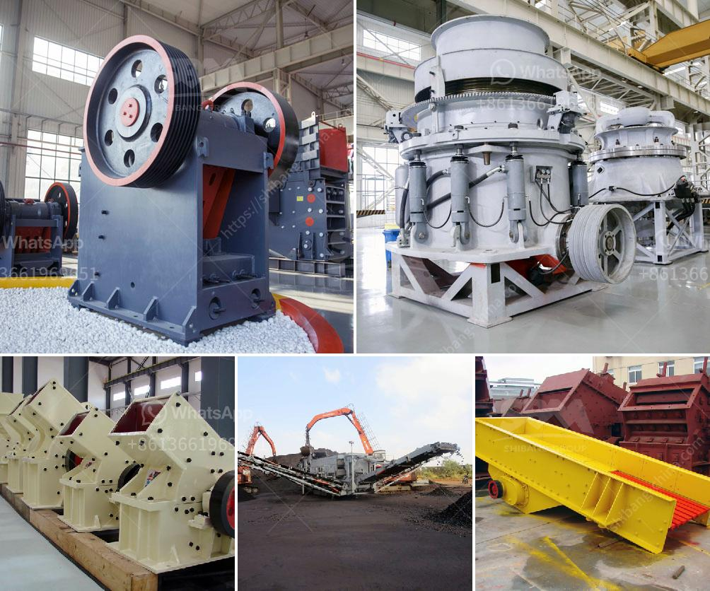

<h3>gold plant for sale in africa</h3>
In recent years, the demand for gold plants in Africa has skyrocketed, reflecting the growing interest in exploring and extracting this precious metal. With its vast natural resources and thriving gold mining industry, Africa has become a hotspot for investors and enterprises seeking to acquire gold plants for sale.

Gold plants, also known as gold processing plants, are crucial to the mining process as they are designed to extract the valuable metal from its ore. These plants incorporate various techniques and technologies to separate the gold from the surrounding rocks and minerals. They are often equipped with crushers, ball mills, carbon-in-leach tanks, and other necessary machinery for efficient gold extraction.

Africa boasts numerous regions renowned for their abundant gold reserves, including West Africa, Southern Africa, and the East African Rift System. Ghana, South Africa, and Tanzania are among the leading gold-producing countries on the continent. Hence, it comes as no surprise that these countries and their neighboring regions are witnessing a surge in gold plant sales.

The sale of gold plants in Africa provides opportunities for both established mining companies and new entrants. Established companies can enhance their existing infrastructure and expand their operations by acquiring additional gold plants. On the other hand, new players in the industry can purchase these plants to kick-start their mining ventures and take advantage of Africa's rich gold deposits.

The availability of gold plants for sale in Africa offers a range of options to suit different budgets and requirements. From smaller, portable plants suitable for small-scale mining operations to larger, sophisticated plants capable of processing substantial volumes of ore, there is something for every investor.

Moreover, purchasing a gold plant in Africa often comes with the added advantage of expert knowledge and experience. Many suppliers and mining companies that offer gold plants for sale provide technical support and guidance to ensure the plants are set up and operated efficiently.

If you are considering investing in the gold mining industry, exploring the availability of gold plants for sale in Africa is undoubtedly a promising avenue to explore. Africa's gold-rich regions present a wealth of opportunities for those looking to enter or expand their presence in the global gold market, making it an exciting time for investors to tap into this flourishing sector.
<h3>Contact us</h3><ul><li><strong>Whatsapp:&nbsp;<a href="https://wa.me/8613661969651">+8613661969651</a></strong></li><li><a href="https://swt.shibang-china.com/?git&amp;zhl&amp;gold plant for sale in africa"><strong>Online Service(chat now)</strong></a></li></ul><h3>Related</h3><ul><li><a href='magnesite mining analysis south africa.md'>magnesite mining analysis south africa</a></li><li><a href='diagram of stone crusher operation.md'>diagram of stone crusher operation</a></li><li><a href='gold refining equipment for sale.md'>gold refining equipment for sale</a></li><li><a href='crusher manufacturers in russia.md'>crusher manufacturers in russia</a></li><li><a href='grinding raymond mill for sale.md'>grinding raymond mill for sale</a></li></ul>