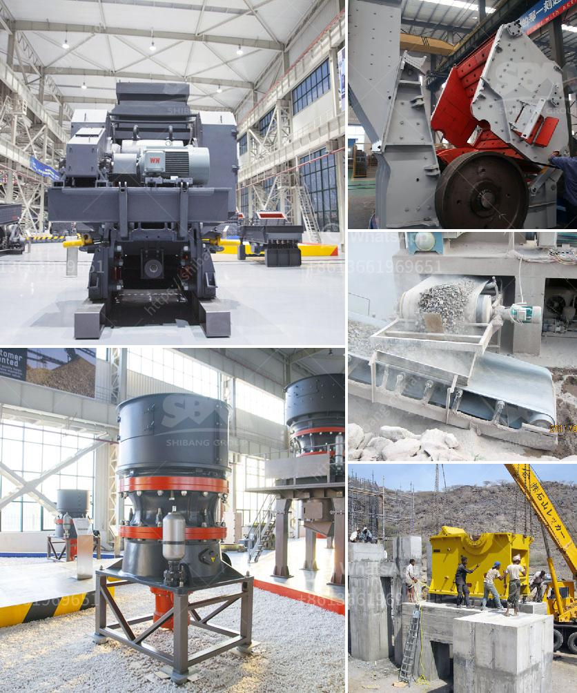

<h3>gold plant for sale south africa</h3>
South Africa has long been a leading producer of gold and other precious metals, making it a prime location for prospective gold miners. Now, with the rising demand for gold and the current economic climate, more and more people are considering investing in gold plants for sale in South Africa.

A gold plant is a facility that processes gold ore to extract the valuable metal from it. These plants typically consist of several different machinery and equipment, such as crushers, conveyors, grinding mills, and flotation cells. They are specifically designed to efficiently and effectively extract gold from the ore.

One of the key advantages of buying a gold plant for sale in South Africa is that it offers investors with a ready-to-use facility. Rather than starting from scratch, which can be time-consuming and costly, investing in an existing gold plant allows for quicker start-up and operations. As a result, investors can begin the production process sooner and start generating revenue.

Another advantage is that South Africa is a well-established mining jurisdiction, known for its rich gold reserves and mining infrastructure. The country boasts several decades of gold mining history, with well-developed exploration, mining, and processing systems in place. This not only offers reassurance to investors but also provides them with access to a pool of experienced mining professionals and suppliers.

In addition, the gold plant market in South Africa is highly competitive. There are numerous plants available for sale, ranging in sizes and capacities, catering to different investment requirements. This diversity in the market allows potential investors to find a plant that suits their needs and budget.

When considering a gold plant for sale in South Africa, it is important to conduct thorough due diligence. This includes assessing the plant's current condition, its history of production, and its compliance with environmental and safety regulations. It is also crucial to consider the potential for expansion and the availability of necessary permits and licenses.

Furthermore, it is advisable to engage the services of consultants or experts in the gold mining industry to assist with the evaluation process. Their knowledge and expertise can provide invaluable guidance, ensuring that investors make informed decisions.

Investing in a gold plant for sale in South Africa can be a lucrative venture. However, like any investment, it comes with risks and uncertainties. The fluctuating price of gold, regulatory changes, and operational challenges are all factors that need careful consideration.

Nevertheless, with the right preparation and strategy, investing in a gold plant in South Africa can offer significant opportunities for financial growth. As the demand for gold continues to rise, especially in uncertain economic times, investing in a gold plant can be a wise decision for individuals and companies alike.

In conclusion, South Africa offers a wide range of gold plants for sale, providing investors with an opportunity to capitalize on the precious metal's high demand. However, investing in a gold plant requires careful evaluation and consideration of various factors. With the right approach and professional guidance, investing in a gold plant in South Africa can lead to long-term success in the gold mining industry.
<h3>Contact us</h3><ul><li><strong>Whatsapp:&nbsp;<a href="https://wa.me/8613661969651">+8613661969651</a></strong></li><li><a href="https://swt.shibang-china.com/?git&amp;zhl&amp;gold plant for sale south africa"><strong>Online Service(chat now)</strong></a></li></ul><h3>Related</h3><ul><li><a href='mini cone crusher price used.md'>mini cone crusher price used</a></li><li><a href='jual jaw crusher bekas surabaya.md'>jual jaw crusher bekas surabaya</a></li><li><a href='crusher machine price in pakistan.md'>crusher machine price in pakistan</a></li><li><a href='fullers earth powder grinding machines in india.md'>fullers earth powder grinding machines in india</a></li><li><a href='crusher machine for sale philippines.md'>crusher machine for sale philippines</a></li></ul>