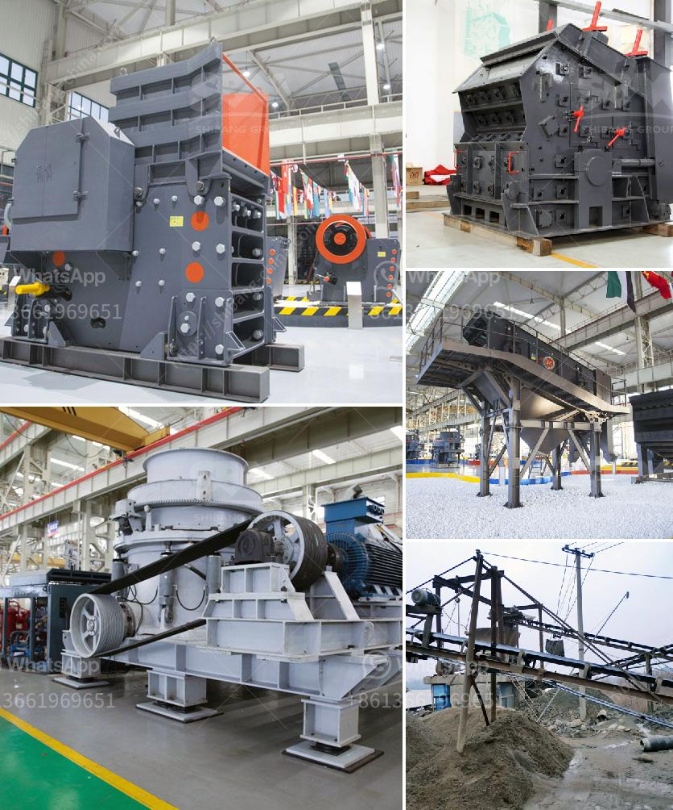

<h3>gold processing per hour</h3>
Gold processing is a crucial step in the extraction and refinement of gold. It involves various techniques and processes to achieve the desired purity and quality of the precious metal. One of the key factors in gold processing is the amount of gold that can be processed per hour, which directly impacts the efficiency and profitability of the operation.

To understand the significance of gold processing per hour, it is important to first recognize the steps involved in the process. Gold processing typically starts with the crushing and grinding of ore, followed by a series of chemical and physical treatments to extract the gold from the ore. These treatments may include flotation, cyanidation, carbon adsorption, and smelting.

The rate at which gold can be processed per hour largely depends on the plant's design, equipment, and operating conditions. Modern gold processing plants are designed to handle large volumes of ore and can process thousands of tons per hour. However, smaller-scale operations may have a limited processing capacity, usually ranging from a few hundred to a few thousand kilograms per hour.

Apart from the processing equipment and plant design, other factors can also influence the gold processing rate. These factors include the ore type and characteristics, the particle size distribution of the ore, the concentration of gold in the ore, and the desired purity of the final product. For instance, high-grade gold ores with larger particle sizes may require less time for processing compared to low-grade ores with finer particles.

Efficient gold processing per hour is essential for maximizing the profitability of the operation. By processing larger volumes of ore within a given time frame, more gold can be extracted and refined. This directly translates into increased gold production and revenue. Moreover, processing more ore per hour also reduces operational costs by spreading the fixed costs of equipment and labor over a larger output.

To achieve optimal gold processing rates, plant operators need to carefully balance several factors. The equipment must be properly sized, taking into account the expected production rates and ore characteristics. The chosen processing techniques and optimization parameters should be tailored to the specific ore type to minimize processing time and maximize gold recovery.

Continuous monitoring and optimization of the process parameters can also help improve gold processing per hour. By closely tracking KPIs such as recovery rates, process efficiency, and downtime, plant operators can identify bottlenecks or inefficiencies and take corrective actions. Advanced process control systems and automation technologies can further enhance the efficiency and productivity of gold processing operations.

In conclusion, gold processing per hour is a critical factor in the extraction and refinement of gold. The ability to process larger volumes of ore within a given time frame directly impacts the profitability and efficiency of the operation. By carefully balancing various factors, such as plant design, equipment, and operating conditions, gold processing rates can be optimized to maximize gold production and revenue. Continuous monitoring and optimization are essential to identify and address any bottlenecks or inefficiencies in the process, leading to increased overall efficiency and profitability in gold processing.
<h3>Contact us</h3><ul><li><strong>Whatsapp:&nbsp;<a href="https://wa.me/8613661969651">+8613661969651</a></strong></li><li><a href="https://swt.shibang-china.com/?git&amp;zhl&amp;gold processing per hour"><strong>Online Service(chat now)</strong></a></li></ul><h3>Related</h3><ul><li><a href='stone crushing machines in uk.md'>stone crushing machines in uk</a></li><li><a href='coal mill in power plant.md'>coal mill in power plant</a></li><li><a href='mobile crusher south africa.md'>mobile crusher south africa</a></li><li><a href='proposal usaha stone crusher.md'>proposal usaha stone crusher</a></li><li><a href='industrial roller mill.md'>industrial roller mill</a></li></ul>