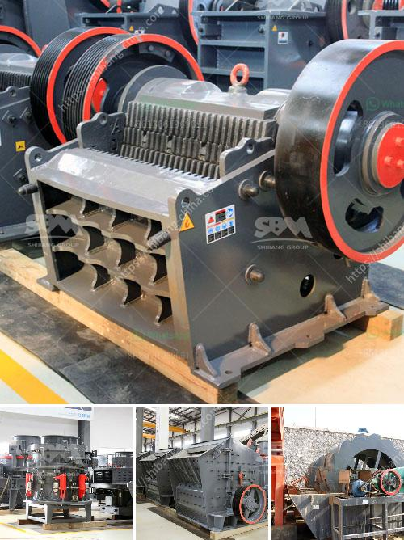

<h3>gold processing plant dry</h3>
A gold processing plant is a facility where gold ore is refined and purified to extract the precious metal. Dry processing plants for gold are becoming increasingly popular due to their efficiency and cost-effectiveness. By using air instead of water in the process, these plants can effectively recover gold particles without the need for extensive water usage.

Dry gold processing plants operate by crushing the ore into smaller particles, which are then passed through various stages of sorting and separation. Air is used to blow away lighter materials, such as sand and gravel, leaving the gold particles behind. This process is known as gravity separation, as it relies on the weight and density of the gold to separate from the other materials.

One of the major advantages of dry gold processing plants is their ability to operate in remote areas with limited water sources. In regions with arid climates or where water scarcity is an issue, dry processing plants offer a sustainable and environmentally friendly alternative to traditional gold processing methods. They also significantly reduce the overall water consumption, which is not only cost-effective but also helps preserve precious water resources.

Additionally, dry processing plants typically have a smaller footprint, making them more suitable for locations where space is limited. They can be easily transported and set up in different mining sites, allowing for greater flexibility and adaptability to changing ore sources.

Another benefit of dry gold processing plants is their efficiency in extracting gold particles. Due to the absence of water, the concentrating and separating processes can be optimized, resulting in higher recovery rates and increased gold production. This makes dry processing plants a viable option for miners looking to maximize their gold yield while minimizing operational costs.

In summary, dry gold processing plants offer numerous advantages over traditional water-based processing methods. They provide a more sustainable and environmentally friendly solution, reduce water consumption, and increase overall gold recovery rates. As mining operations worldwide continue to face challenges related to water scarcity and environmental regulations, dry gold processing plants are becoming an increasingly attractive option for gold miners.
<h3>Contact us</h3><ul><li><strong>Whatsapp:&nbsp;<a href="https://wa.me/8613661969651">+8613661969651</a></strong></li><li><a href="https://swt.shibang-china.com/?git&amp;zhl&amp;gold processing plant dry"><strong>Online Service(chat now)</strong></a></li></ul><h3>Related</h3><ul><li><a href='used rock crushing plant for sale in uae.md'>used rock crushing plant for sale in uae</a></li><li><a href='portable jaw crusher plant.md'>portable jaw crusher plant</a></li><li><a href='lme copper ore price calculations.md'>lme copper ore price calculations</a></li><li><a href='impact crusher tanzania.md'>impact crusher tanzania</a></li><li><a href='jaw crusher pe 150x250.md'>jaw crusher pe 150x250</a></li></ul>