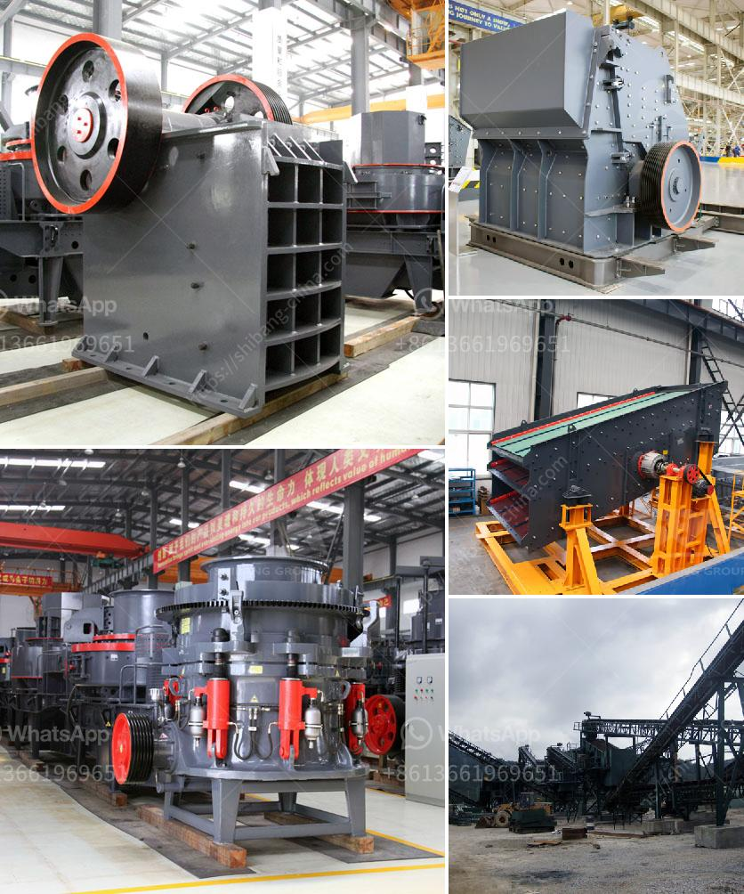

<h3>gold refining equipment for sale</h3>
Gold refining is a highly influential process in extracting the purest form of gold from its raw ore. This extensive procedure involves various stages, including crushing the ore, washing it, and extracting the precious metal using chemicals. However, even the most skillful gold refiners cannot achieve the desired outcome without the right equipment. That's where gold refining equipment comes into play, offering sophisticated tools and machines to aid in the refining process.

One crucial piece of equipment is the crucible, designed to withstand extreme temperatures. Crucibles are typically made from ceramic, graphite, or stainless steel, ensuring they can endure the heat required to melt gold. They come in various sizes to accommodate different amounts of ore during the refining process.

Another essential tool is the furnace, which is used to heat the crucible and melt the ore. Furnaces can be electric or gas-powered, with electric furnaces being the most common choice for small-scale refineries. Electric furnaces are easy to operate, require minimal maintenance, and provide consistent heating, making them ideal for beginners or hobbyists starting their gold refining journey.

To extract the impurities from the molten gold, a flux is necessary. A flux acts as a cleaning agent, helping to remove any unwanted elements or minerals. Borax is commonly used as a flux in gold refining due to its effectiveness in absorbing impurities. Other fluxes include soda ash, silica, and ammonium chloride, which are used in specific refining techniques.

The process of separating impurities from gold requires specific chemical reactions. Chemicals such as nitric acid, hydrochloric acid, and aqua regia are used to dissolve impurities and separate them from the gold. These chemicals should be handled with extreme caution due to their corrosive nature. Proper protective gear, such as gloves, goggles, and a lab coat, should always be worn when working with these chemicals.

Once the impurities are removed and the gold is in its purest form, it can be molded into desired shapes. Gold molds, made from graphite or other heat-resistant materials, are necessary for this step. Molds come in various sizes and shapes, allowing individuals to create custom gold bars, coins, or jewelry.

Now, let's discuss the availability of gold refining equipment for sale. Many reputable companies specialize in producing and supplying high-quality refining equipment. These companies offer a wide range of products, from basic tools to advanced machinery, catering to the needs of both professionals and hobbyists. Online platforms, such as e-commerce websites, are great resources for finding gold refining equipment for sale.

When purchasing gold refining equipment, it is crucial to consider factors such as the reputation of the supplier, product quality, and after-sales support. Reading customer reviews and testimonials can provide valuable insights into the reliability and performance of the equipment. Additionally, it is essential to ensure that the equipment meets safety standards and regulatory requirements.

In conclusion, gold refining equipment plays a vital role in the extraction of pure gold from its raw ore. With the right tools and machines, this complex process becomes more efficient and effective. From crucibles and furnaces to chemicals and molds, there is a wide range of equipment available for sale to accommodate different refining needs. However, it is essential to research and choose reputable suppliers to ensure the quality and safety of the equipment.
<h3>Contact us</h3><ul><li><strong>Whatsapp:&nbsp;<a href="https://wa.me/8613661969651">+8613661969651</a></strong></li><li><a href="https://swt.shibang-china.com/?git&amp;zhl&amp;gold refining equipment for sale"><strong>Online Service(chat now)</strong></a></li></ul><h3>Related</h3><ul><li><a href='complete mobile stone crushing machine 30th.md'>complete mobile stone crushing machine 30th</a></li><li><a href='bentonite processing plant.md'>bentonite processing plant</a></li><li><a href='antimony ore processing plant design.md'>antimony ore processing plant design</a></li><li><a href='diesel stone crushers from germany.md'>diesel stone crushers from germany</a></li><li><a href='grinding zeolite ball mill machine.md'>grinding zeolite ball mill machine</a></li></ul>