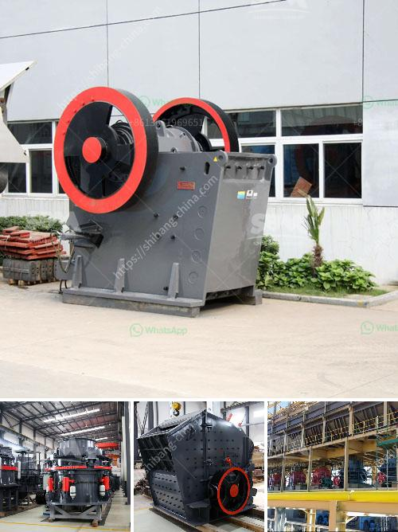

<h3>gold wash plant for sale in brazil</h3>
Gold mining has been a lucrative industry in Brazil for centuries, with the country being one of the world's largest producers of gold. With the rising demand for this precious metal, the need for efficient equipment and technology has become a priority for gold miners. One such equipment that has proven to be highly effective is the gold wash plant.

A gold wash plant is a specialized piece of equipment that is used to separate gold from sand and gravel. This plant typically consists of a trommel screen and a shaking table, as well as a water pump and a diesel generator. The trommel screen allows for the efficient separation of gold-bearing material from the rest of the debris, while the shaking table helps concentrate the gold particles into a manageable concentrate.

One of the reasons why gold wash plants have become popular in Brazil is their ability to process large volumes of material quickly. This is crucial as gold miners often need to process vast amounts of sand and gravel to find significant amounts of gold. With a well-designed and robust gold wash plant, miners can process up to hundreds of tons of material per hour, greatly increasing their chances of finding gold.

Another advantage of using a gold wash plant is that it reduces the environmental impact of gold mining. Traditional methods of gold extraction, such as panning or using sluice boxes, can result in significant soil erosion and water pollution. In contrast, a gold wash plant helps minimize the impact on the environment by utilizing water recirculation systems and efficient containment of the material being processed.

Furthermore, gold wash plants can be operated by a small team of miners, making them suitable for small-scale gold mining operations. In Brazil, where many gold mining operations are run by individual or family-run businesses, having a gold wash plant can greatly increase mining efficiency and productivity.

If you are interested in purchasing a gold wash plant in Brazil, there are several options available. Many equipment manufacturers and suppliers offer gold wash plants for sale, designed specifically for the mining industry. These plants come in various sizes and configurations, depending on the specific needs of the miner. Additionally, used gold wash plants can often be found in the market at a lower cost, making them an attractive option for those on a tighter budget.

In conclusion, gold wash plants have proven to be a valuable tool for gold miners in Brazil. Their ability to efficiently separate gold from sand and gravel, process large volumes of material, and minimize environmental impact make them an attractive choice for gold mining operations. If you are in the market for a gold wash plant, consider exploring the options available in Brazil, where the gold mining industry continues to thrive.
<h3>Contact us</h3><ul><li><strong>Whatsapp:&nbsp;<a href="https://wa.me/8613661969651">+8613661969651</a></strong></li><li><a href="https://swt.shibang-china.com/?git&amp;zhl&amp;gold wash plant for sale in brazil"><strong>Online Service(chat now)</strong></a></li></ul><h3>Related</h3><ul><li><a href='iron slag crusher india.md'>iron slag crusher india</a></li><li><a href='sand crushing equipment sale in tanzania.md'>sand crushing equipment sale in tanzania</a></li><li><a href='cement grinding units manufacturing in bangalore.md'>cement grinding units manufacturing in bangalore</a></li><li><a href='hammer crushers price.md'>hammer crushers price</a></li><li><a href='rotary kiln cement plant cost in india.md'>rotary kiln cement plant cost in india</a></li></ul>