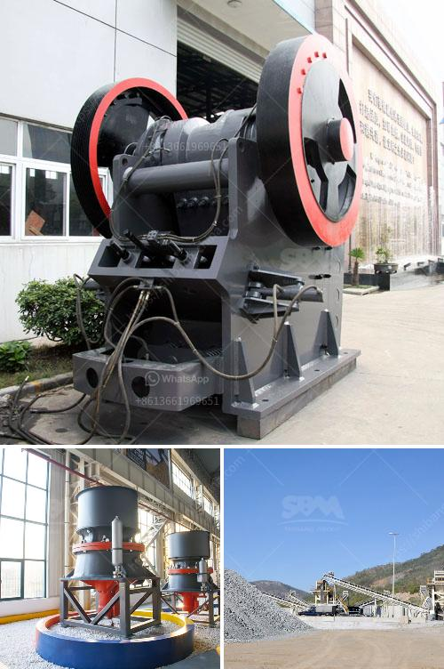

<h3>gold wash plant machine in ghana</h3>
The gold wash plant machine in Ghana is a complete portable plant, which includes the hopper, trommel screen, water pump, vibrating screen, sluice box, gold mining equipment, and so on. Besides, we also provide professional underground mining services.

With rich experience and mature technology, our gold wash plant machine in Ghana has many unique features and advantages:

1. It's easily portable and highly efficient: The gold wash plant machine is equipped with a sturdy and portable structure, which allows you to transport it to any location with ease. It also has a high processing capacity, which ensures maximum productivity and efficiency in gold mining operations.

2. It's environmentally friendly: Our gold wash plant machine in Ghana adopts a water recycling system, which minimizes water usage and reduces environmental impact. This system not only saves water but also helps to prevent pollution caused by contaminated water discharge.

3. It's cost-effective: The gold wash plant machine is designed for small and medium-sized gold mining operations in Ghana. It offers a cost-effective solution for alluvial gold mining projects, allowing you to recover gold without huge investment.

4. It's reliable and easy to operate: The gold wash plant machine is designed with a user-friendly interface, making it easy for operators to control and operate the machine. It also comes with a comprehensive manual and on-site training services, ensuring that you can run the machine smoothly and efficiently.

5. It's versatile and customizable: Our gold wash plant machine in Ghana can be customized to meet your specific mining requirements. We offer a wide range of optional equipment, such as generators, compressors, crushers, and ore feeders, which can be integrated into the plant according to your needs.

In summary, the gold wash plant machine in Ghana is a cost-effective and environmentally friendly solution for alluvial gold mining operations. Its portable and efficient design, combined with its versatility and customizable features, makes it a top choice for gold miners in Ghana. With our professional services and technical support, you can trust us to provide the best equipment and solutions for your mining project. Contact us today to learn more about our gold wash plant machine in Ghana and start your gold mining journey.
<h3>Contact us</h3><ul><li><strong>Whatsapp:&nbsp;<a href="https://wa.me/8613661969651">+8613661969651</a></strong></li><li><a href="https://swt.shibang-china.com/?git&amp;zhl&amp;gold wash plant machine in ghana"><strong>Online Service(chat now)</strong></a></li></ul><h3>Related</h3><ul><li><a href='lokomo jaw crusher.md'>lokomo jaw crusher</a></li><li><a href='coal powder making machine.md'>coal powder making machine</a></li><li><a href='how pyrite mined and processed.md'>how pyrite mined and processed</a></li><li><a href='crusher plant layout.md'>crusher plant layout</a></li><li><a href='impact crusher 70 130tph.md'>impact crusher 70 130tph</a></li></ul>