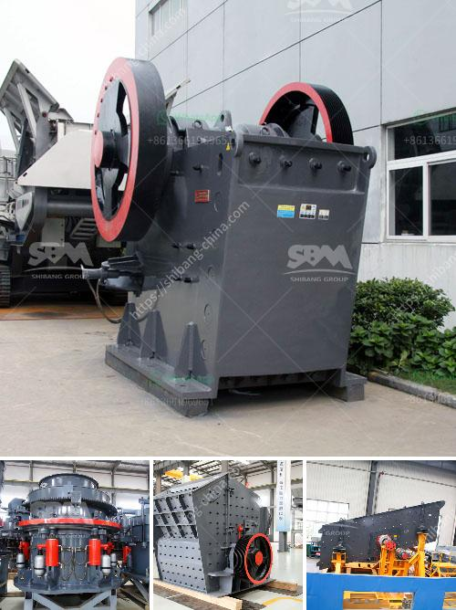

<h3>gold wash plant trummel revelstoke</h3>
In the world of gold mining, finding a reliable and efficient gold wash plant is one of the key factors for success. Introducing the Gold Wash Plant Trummel Revelstoke – a revolutionary machine that promises to simplify and streamline the gold mining process.

Located in Revelstoke, British Columbia, this cutting-edge wash plant has already won the hearts of many gold miners. With its innovative design and state-of-the-art technology, it has proven to be a game-changer in the industry.

One of the standout features of the Gold Wash Plant Trummel Revelstoke is its mobility. Unlike traditional wash plants that require extensive setup and permanent foundation, this portable wash plant can be easily transported to different mining locations. It comes equipped with sturdy wheels and a trailer for effortless mobility. This means that gold miners can now reach remote and hard-to-access areas, maximizing their chances of striking gold.

Efficiency is another key factor that sets the Gold Wash Plant Trummel Revelstoke apart from its competitors. It boasts a trommel design, which is renowned for its high processing capacity. The trommel rotates, sifting through the gold-bearing materials, while simultaneously washing them. This double-action not only saves valuable time but also allows for a more thorough and efficient separation of gold from other debris. With this innovative design, miners can process larger volumes of material, increasing their chances of finding significant gold deposits.

Additionally, the Gold Wash Plant Trummel Revelstoke offers a built-in sluice box and wash plant system. The sluice box is a tried-and-tested method to catch gold particles, as it uses the principle of gravity separation. The wash plant system further enhances the gold recovery process, ensuring that no gold is lost during the washing and sorting stages.

Durability is a crucial aspect to consider in any gold mining equipment, and the Gold Wash Plant Trummel Revelstoke shines in this department. Built with high-quality materials and expert craftsmanship, this wash plant is designed to withstand the harsh conditions of gold mining. Whether it's rocky terrains or extreme weather conditions, this machine is built to last, ensuring that miners can rely on it for years to come.

Not only does the Gold Wash Plant Trummel Revelstoke offer exceptional functionality, but it also prioritizes user-friendliness. The intuitive control panel allows easy operation, with adjustable settings to cater to different mining requirements. The wash plant is also designed with maintenance in mind, ensuring that any necessary repairs or upgrades can be carried out swiftly and with ease.

In conclusion, the Gold Wash Plant Trummel Revelstoke has set a new benchmark in the gold mining industry. With its portability, efficiency, durability, and user-friendly features, it has become the go-to choice for gold miners looking to optimize their operations. Whether you are a seasoned prospector or a beginner, this wash plant promises to simplify the gold mining process and increase your chances of striking gold. So why wait? Get your hands on the Gold Wash Plant Trummel Revelstoke and embrace the future of gold mining today.
<h3>Contact us</h3><ul><li><strong>Whatsapp:&nbsp;<a href="https://wa.me/8613661969651">+8613661969651</a></strong></li><li><a href="https://swt.shibang-china.com/?git&amp;zhl&amp;gold wash plant trummel revelstoke"><strong>Online Service(chat now)</strong></a></li></ul><h3>Related</h3><ul><li><a href='x36 double roller crusher used.md'>x36 double roller crusher used</a></li><li><a href='pulverizer crusher manufacturer in pune.md'>pulverizer crusher manufacturer in pune</a></li><li><a href='hammer crusher pc400.md'>hammer crusher pc400</a></li><li><a href='alluvial gold washing plants.md'>alluvial gold washing plants</a></li><li><a href='equipment cost for silica sand mining.md'>equipment cost for silica sand mining</a></li></ul>