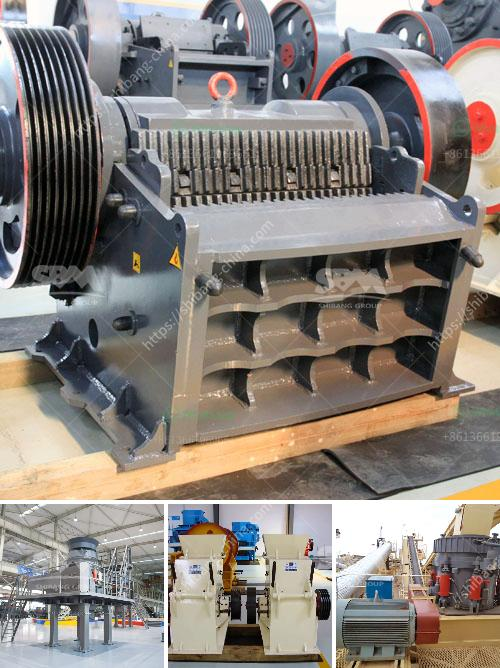

<h3>gold washing machine for small miners</h3>
Small-scale gold mining has played a crucial role in many developing countries, contributing to the economic growth and livelihoods of millions of people. However, the traditional methods used by small miners often involve manual labor and inefficient techniques, hindering their ability to maximize output and minimize environmental impact. The gold washing machine has emerged as a game-changer by significantly improving the efficiency of gold recovery for small miners. In this article, we explore the benefits and impact of this innovative technology.

One of the primary advantages of using a gold washing machine is the significant increase in efficiency and productivity. Traditionally, miners relied on manual washing of ore-bearing gravel, a labor-intensive process that is not only time-consuming but also yields limited results. With the introduction of gold washing machines, however, the separation and extraction of gold from other materials became faster and more effective.

Gold washing machines are specifically designed keeping in mind the needs of small miners who often have limited space and resources. These machines are compact and portable, making them easy to transport to remote mining sites. Their small size does not compromise their functionality, though, as they are equipped with advanced technologies that maximize gold recovery while minimizing water and energy consumption.

The gold washing machine employs a combination of mechanical and chemical processes to remove impurities and recover gold particles. This results in enhanced recovery rates compared to traditional methods, where substantial amounts of gold were often lost during the panning and washing process. Moreover, these machines are designed to extract gold from low-grade ores that were previously deemed unprofitable, thereby significantly boosting the income potential for small miners.

Apart from increasing productivity, the gold washing machine also improves the overall environmental and health conditions associated with small-scale mining operations. By replacing traditional methods such as mercury amalgamation, which poses serious health risks, this technology promotes safer mining practices. Additionally, the incorporation of water-recycling systems in these machines reduces water usage, addressing the ecological concerns associated with mining operations.

The introduction of gold washing machines has contributed to the economic empowerment of small-scale miners. By increasing gold recovery rates and making previously unviable ore profitable, these machines enable miners to generate higher incomes and improve their standard of living. The enhanced productivity also attracts more investment and creates job opportunities within local mining communities, further contributing to economic growth.

The gold washing machine has undoubtedly revolutionized small-scale mining practices by increasing efficiency, productivity, and gold recovery rates. Its compact design, portability, and incorporation of advanced technologies make it an ideal tool for resource-limited small miners. Furthermore, the use of these machines leads to improved environmental sustainability and enhances the economic well-being of mining communities. As the demand for responsibly sourced gold continues to rise, the gold washing machine will continue to play a crucial role in shaping the future of small-scale mining.
<h3>Contact us</h3><ul><li><strong>Whatsapp:&nbsp;<a href="https://wa.me/8613661969651">+8613661969651</a></strong></li><li><a href="https://swt.shibang-china.com/?git&amp;zhl&amp;gold washing machine for small miners"><strong>Online Service(chat now)</strong></a></li></ul><h3>Related</h3><ul><li><a href='services nigeria conveyor machine.md'>services nigeria conveyor machine</a></li><li><a href='chrome sands washing plant with prices.md'>chrome sands washing plant with prices</a></li><li><a href='7x8 foot ball mills.md'>7x8 foot ball mills</a></li><li><a href='sandstone crusher quarry.md'>sandstone crusher quarry</a></li><li><a href='manufacture of a cone crusher.md'>manufacture of a cone crusher</a></li></ul>