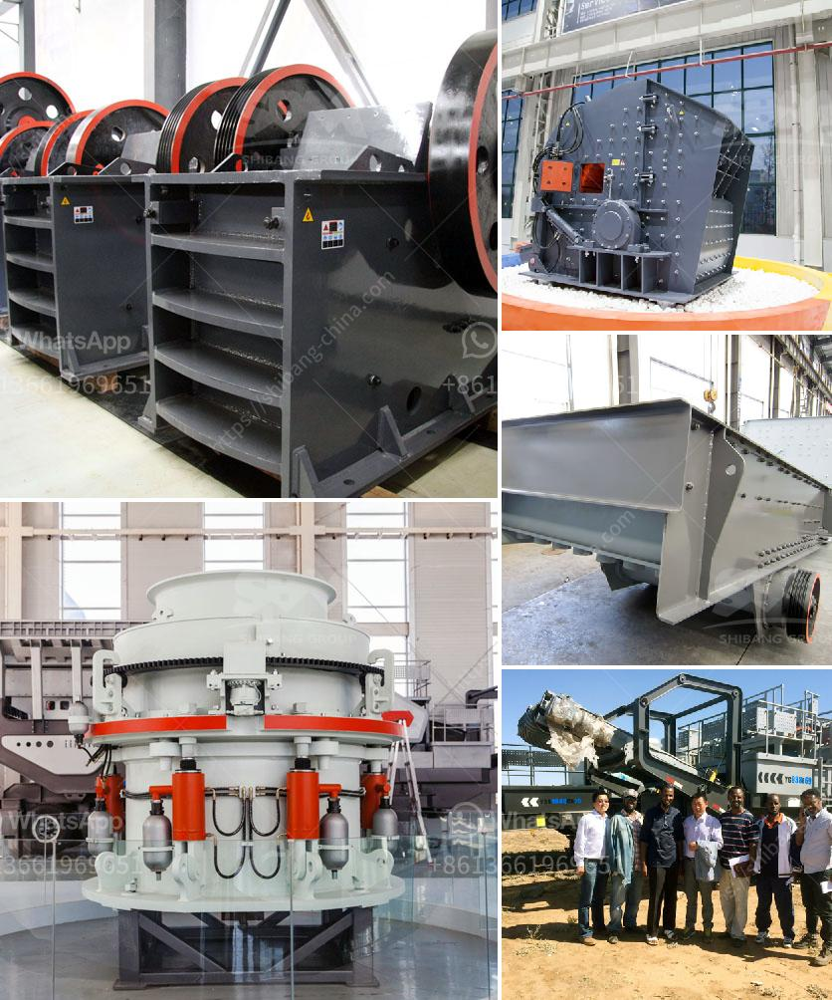

<h3>granite crusher cost</h3>
Granite is a type of igneous rock that is commonly found in the Earth's crust. It is widely used for various construction purposes due to its durability and aesthetic appeal. One of the most popular uses for granite is in the production of granite crusher, which is also known as granite stone crusher.

Granite crusher is a primary crusher that is used to crush granite into small pieces. It is often used as a secondary crusher due to its high crushing capacity and high reduction ratio. The crushed granite can be used as construction aggregates, asphalt pavement filler, or railway ballast.

When it comes to the cost of granite crusher, there are many factors to consider. The cost can vary depending on the size, quality, and location of the granite. Generally, granite crusher is more expensive than other types of stone crushers because it requires advanced technology and has higher production capacity.

The cost of granite crusher also depends on the quantity of granite that needs to be crushed. If you have a large-scale project, it will require more granite and, therefore, increase the cost. On the other hand, if you only need a small amount of crushed granite, the cost will be relatively lower.

Another factor that affects the cost of granite crusher is the transportation cost. Granite is a heavy stone, and it requires special equipment and transportation methods to transport it from the quarry to the crusher site. The transportation cost can be significant, especially if the crusher is located far away from the quarry.

In conclusion, the cost of granite crusher can vary depending on various factors such as size, quality, quantity, and transportation. It is important to consider these factors before deciding to invest in a granite crusher. Although it may be expensive, the durability and aesthetic appeal of granite make it a worthwhile investment for many construction projects.
<h3>Contact us</h3><ul><li><strong>Whatsapp:&nbsp;<a href="https://wa.me/8613661969651">+8613661969651</a></strong></li><li><a href="https://swt.shibang-china.com/?git&amp;zhl&amp;granite crusher cost"><strong>Online Service(chat now)</strong></a></li></ul><h3>Related</h3><ul><li><a href='working principle of pebble mill.md'>working principle of pebble mill</a></li><li><a href='stone crushers fron china.md'>stone crushers fron china</a></li><li><a href='crusher plant business requirement in paistan.md'>crusher plant business requirement in paistan</a></li><li><a href='limestone powder conveying system.md'>limestone powder conveying system</a></li><li><a href='gypsum mining crusher in kenya manufacturer.md'>gypsum mining crusher in kenya manufacturer</a></li></ul>