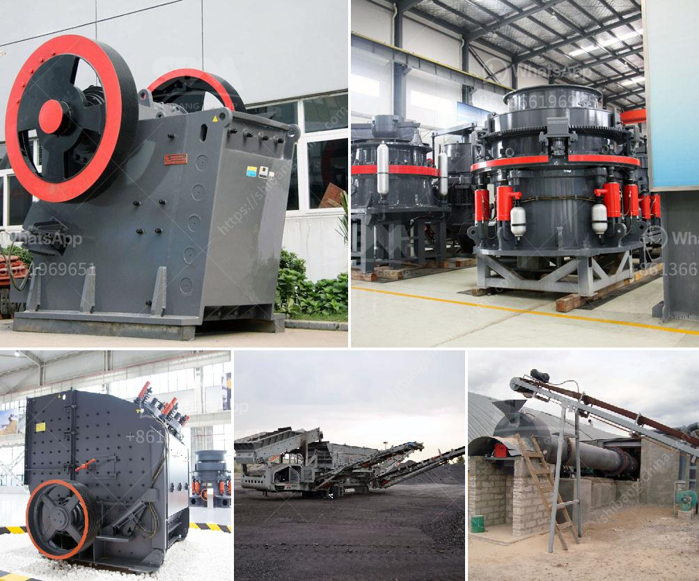

<h3>granite crushers machine from germany</h3>
Granite is a common building material that is found in abundance in different parts of the world, including Germany. It is widely used as a major component in construction and architectural projects due to its durability and aesthetic appeal. To break down these sturdy rocks into smaller, manageable sizes, granite crushers machines are used.

In Germany, the renowned German machinery manufacturer, Kleemann, has pioneered the development of track-mounted, mobile crushing and screening plants. These machines allow the mining and quarrying industries to easily move the crushers from one site to another, enabling flexibility and convenient operation.

One of the key features of granite crushers machines from Germany is the ability to crush materials in a closed circuit production, which dramatically reduces the cost of transporting materials to a crushing site. This technology offers the possibility to utilize existing infrastructure efficiently while also minimizing the environmental impact linked to the transport of materials.

Furthermore, these machines are equipped with advanced automation systems, allowing operators to monitor and control the entire crushing process remotely. This not only ensures optimum performance but also enhances safety and productivity. The machines can be easily adjusted based on the desired end-product specifications, providing the highest quality and consistency in the crushed granite materials.

Granite crushers machines from Germany are also designed to avoid dust emissions. This not only ensures the safety of the operators but also helps to protect the environment. Dust collection systems are often installed to capture and filter out any dust particles that may be generated during the crushing process. Additionally, water sprayers can be integrated into the machine to further suppress dust and improve air quality.

The powerful crushing capabilities of these machines allow for the efficient processing of a wide range of granite materials. From large blocks to smaller, more uniform sizes, these crushers can handle various applications, including road construction, building foundations, and railway ballasts. The versatility offered by granite crushers machines from Germany makes them a valuable asset in various industries.

In conclusion, granite crushers machines from Germany offer numerous advantages for the mining and quarrying industries. With their mobility and advanced automation features, these machines provide convenient and efficient crushing solutions. The ability to process materials in a closed circuit production and the inclusion of dust control measures further enhance their functionality. The use of these machines not only ensures the highest quality crushed granite materials but also improves safety and minimizes environmental impact. Overall, the German machinery manufacturer, Kleemann, has made significant contributions to the development of efficient and sustainable granite crushers machines.
<h3>Contact us</h3><ul><li><strong>Whatsapp:&nbsp;<a href="https://wa.me/8613661969651">+8613661969651</a></strong></li><li><a href="https://swt.shibang-china.com/?git&amp;zhl&amp;granite crushers machine from germany"><strong>Online Service(chat now)</strong></a></li></ul><h3>Related</h3><ul><li><a href='clay grinding machine price list in andhra pradesh.md'>clay grinding machine price list in andhra pradesh</a></li><li><a href='crushed stone suppliers manufacture india.md'>crushed stone suppliers manufacture india</a></li><li><a href='gypsum board manufacturing plant.md'>gypsum board manufacturing plant</a></li><li><a href='raymond mill mumbai and africa.md'>raymond mill mumbai and africa</a></li><li><a href='stone crusher machine in russia.md'>stone crusher machine in russia</a></li></ul>