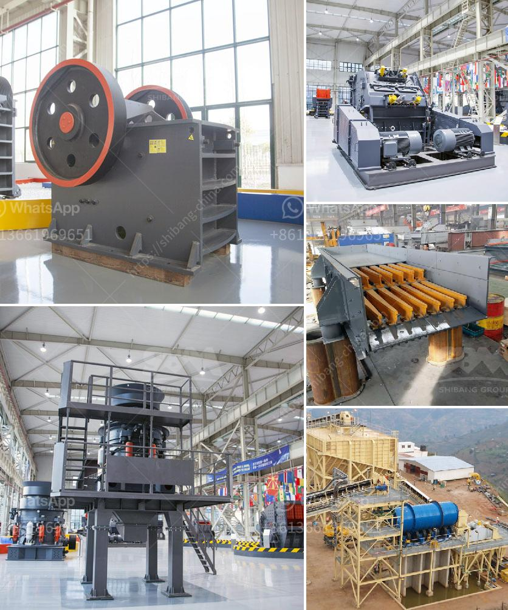

<h3>granite machine manufacturer india</h3>
India has emerged as one of the leading manufacturers of granite processing machines, supplying high-quality equipment to both domestic and international markets. With a rich history of precision engineering and an abundance of natural resources, India has become a global powerhouse in the granite machine manufacturing industry.

The granite processing industry in India has seen significant growth over the years, thanks to its vast granite reserves and a skilled workforce. Indian manufacturers have capitalized on these advantages to produce state-of-the-art machinery that meets the requirements of diverse clients, ranging from large-scale processing facilities to small and medium-sized enterprises.

Granite machine manufacturers in India offer a wide range of machinery, including cutting, polishing, and edge profiling machines, as well as CNC routers and bridge saws. These machines are designed and manufactured using advanced technology, ensuring high precision and efficiency in granite processing.

Quality is a top priority for Indian granite machine manufacturers. They adhere to stringent quality standards and use only the finest materials to produce machines that are durable, reliable, and high performing. Additionally, they invest in continuous research and development to stay at the forefront of technological advancements in the industry.

The reputation of Indian granite machine manufacturers has spread beyond their domestic market. They have successfully exported their machinery to countries around the world, including the United States, Europe, and Australia. Their commitment to delivering top-quality machines, along with excellent after-sales service, has earned them a loyal customer base globally.

Moreover, Indian granite machine manufacturers offer competitive pricing, making their products accessible to a wide range of customers. This has contributed to the growth of the granite processing industry in various regions, as businesses can invest in high-quality machinery without breaking the bank.

In conclusion, the granite machine manufacturing industry in India has established itself as a global leader in precision engineering. Indian manufacturers have leveraged their abundant natural resources, skilled workforce, and technological expertise to produce cutting-edge machinery that meets the highest standards. With a focus on quality, competitive pricing, and excellent customer service, they have earned the trust and loyalty of clients worldwide. As the demand for granite processing machines continues to rise, India's position as a leading manufacturer is set to strengthen further in the years to come.
<h3>Contact us</h3><ul><li><strong>Whatsapp:&nbsp;<a href="https://wa.me/8613661969651">+8613661969651</a></strong></li><li><a href="https://swt.shibang-china.com/?git&amp;zhl&amp;granite machine manufacturer india"><strong>Online Service(chat now)</strong></a></li></ul><h3>Related</h3><ul><li><a href='stone crushers in kenya.md'>stone crushers in kenya</a></li><li><a href='coal mill outlet temperature.md'>coal mill outlet temperature</a></li><li><a href='small feldspar grinding milling plant in nigeria.md'>small feldspar grinding milling plant in nigeria</a></li><li><a href='mobile crusher japan.md'>mobile crusher japan</a></li><li><a href='stone crusher machine price in uganda.md'>stone crusher machine price in uganda</a></li></ul>