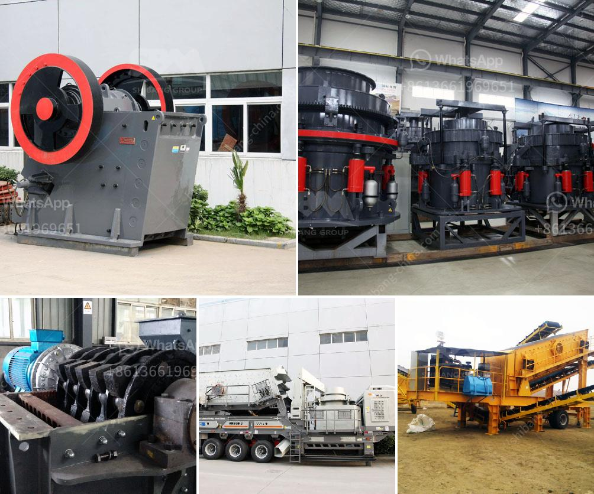

<h3>granite quarry crusher in nigeria</h3>
Granite is a hard, granular rock that is predominantly composed of quartz, feldspar, and mica. The rock was initially discovered in Stephens County, Georgia and was named after the area's granite deposits. Therefore, granite quarry crusher is the primary equipment designed for granite crushing process. As a professional manufacturer of crushing and grinding machinery experts from Zenith, we also provide granite quarry in Nigeria to help customers to make high-quality construction aggregates.

Nigeria is abundant with mineral resources such as coal, bauxite, tantalite, gold, tin, iron ore, limestone, niobium, lead, and zinc, granite and many other types of stones and rocks. To start quarry business or mining project, there are many factors need to be considered including geography, investment cost, ore property, climate, technology and quarry equipment. Zenith provides professional consulting service about mining technology, and customize the suitable quarry crusher and quarry processing equipment for customers.

Granite crushing equipment is essential in quarry plant. We provide world leading quarry crushing machine including jaw crusher, impact crusher, cone crusher, gyratory crusher, mobile crusher etc. Different techniques are required for hard rock quarrying and processing compared with unconsolidated sand and gravel deposits. Zenith provides innovative and customized solutions for different quarrying applications and conditions, including open pit, underground and mobile quarrying.

In Nigeria, the quarrying industry is vastly considered to provide majority of the materials used in the construction sector. Therefore, limestone quarries can be large and long lived, requiring a considerable investment in machinery to produce such building materials. Nigeria is richly endowed with granite stone hence it is among the most available and affordable building materials.

The stone industry in Nigeria is known for its expansion with minimal investment in plants and machinery. Many companies are starting to invest in advanced crushing and grinding technologies to improve production abilities, productivity, and reduce operating costs. Zenith has been dedicated in granite quarrying and processing technology for several decades. With know-how technology, we have been global supplier and manufacturer of crushing, grinding equipment, and quarry crusher.

Crushed granite is in high demand by the construction industry, whilst the prices of sandstone and brick have been skyrocketing due to fuel and transportation costs. This has led to a rise in interest in recycled materials such as landfill waste, crushed concrete, and granite. The granite crushing process is usually operated in dry mode, which is mainly three stages: primary, secondary, and tertiary crushing. The entire granite crushing and processing chain is divided into five stages, including feeding, crushing, screening, grinding, and conveying.

Granite is an incredibly durable and versatile rock that has been used for centuries in the construction industry. Quarrying granite requires a combination of machinery, skilled labor, and meticulous planning. Zenith offers a complete range of granite quarrying and processing equipment to meet any production requirement. The quarry crusher provided by Zenith is with high production capacity, efficiency, and low operation costs. So if you are looking for a reliable and professional crusher manufacturer, Zenith is your ideal choice.
<h3>Contact us</h3><ul><li><strong>Whatsapp:&nbsp;<a href="https://wa.me/8613661969651">+8613661969651</a></strong></li><li><a href="https://swt.shibang-china.com/?git&amp;zhl&amp;granite quarry crusher in nigeria"><strong>Online Service(chat now)</strong></a></li></ul><h3>Related</h3><ul><li><a href='china silica sand vibrating separator screen.md'>china silica sand vibrating separator screen</a></li><li><a href='rotary kiln cement plant cost in india.md'>rotary kiln cement plant cost in india</a></li><li><a href='grinding roller mill machine.md'>grinding roller mill machine</a></li><li><a href='crusher equipment oman in oman.md'>crusher equipment oman in oman</a></li><li><a href='quartz stone machine price.md'>quartz stone machine price</a></li></ul>