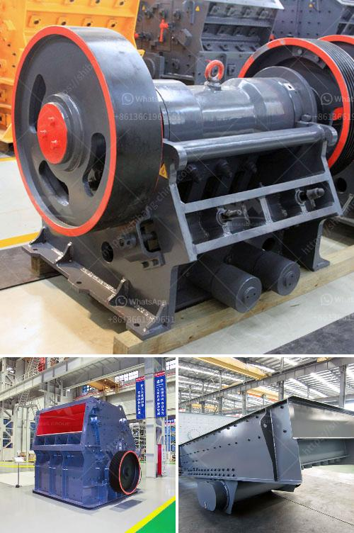

<h3>graphite processing and beneficiation</h3>
Graphite is an allotrope of carbon that holds immense potential in various industries, thanks to its unique properties. With its excellent thermal conductivity, lubricity, electrical conductivity, and high melting point, graphite is widely used in applications like batteries, lubricants, refractories, and electrical devices. However, before graphite can be used in these industries, it needs to undergo a comprehensive processing and beneficiation process to improve its properties and quality.

Graphite processing and beneficiation involve several steps that aim to remove impurities and increase the carbon content. The process begins with crushing and grinding the ore, followed by separation and flotation techniques to remove impurities such as pyrite, silicates, and other organic matter. The graphite ore is then subjected to a series of thermal and chemical treatments to remove impurities and increase its carbon content.

One of the primary methods used for graphite beneficiation is flotation. In this process, the graphite ore is mixed with a chemical reagent that selectively attaches to the graphite particles, allowing them to float to the surface for removal. This step helps separate the graphite from other minerals and impurities present in the ore. Once the graphite concentrate is obtained, additional processing techniques such as acid leaching and thermal treatment are employed to further purify and upgrade the product.

A crucial aspect of graphite processing and beneficiation is understanding the unique characteristics of each graphite deposit. Different types of graphite ores require specialized beneficiation techniques based on their grade, size, and impurity composition. Therefore, it is important to conduct thorough exploration and testing to determine the optimal processing approach for each specific deposit.

Graphite beneficiation not only removes impurities but also aims to improve the properties of the final product. Most graphite ores contain a mix of large and small flakes, and it is desirable to increase the proportion of large flakes in the concentrate as they possess higher purity and value. Several techniques, such as pneumatic and mechanical separation, are employed to achieve optimal flake size distribution and maximize the value of the final concentrate.

The demand for high-quality graphite has surged in recent years, mainly driven by the growing electric vehicle (EV) industry. Lithium-ion batteries, which power electric vehicles, rely heavily on graphite as a key component. Additionally, the renewable energy sector, particularly the production of wind turbine blades, is another significant consumer of graphite. Therefore, efficient graphite processing and beneficiation techniques are vital to meet the increasing demand and ensure a secure supply chain for these burgeoning industries.

In conclusion, graphite processing and beneficiation play a crucial role in unlocking the potential of this versatile mineral. Through a series of mechanical, thermal, and chemical treatments, graphite undergoes improvements in purity, carbon content, and flake size distribution. The tailored beneficiation techniques enable the production of high-quality graphite products for applications in batteries, lubricants, refractories, and electrical devices. With the rapid growth of industries like electric vehicles and renewable energy, the demand for graphite will continue to rise, making efficient processing and beneficiation even more critical for a sustainable and thriving graphite industry.
<h3>Contact us</h3><ul><li><strong>Whatsapp:&nbsp;<a href="https://wa.me/8613661969651">+8613661969651</a></strong></li><li><a href="https://swt.shibang-china.com/?git&amp;zhl&amp;graphite processing and beneficiation"><strong>Online Service(chat now)</strong></a></li></ul><h3>Related</h3><ul><li><a href='dolomite process peritidal subtidal.md'>dolomite process peritidal subtidal</a></li><li><a href='ball mill south africa.md'>ball mill south africa</a></li><li><a href='jaw crusher for 220x160.md'>jaw crusher for 220x160</a></li><li><a href='cement plants for sale.md'>cement plants for sale</a></li><li><a href='stone crushing production process.md'>stone crushing production process</a></li></ul>