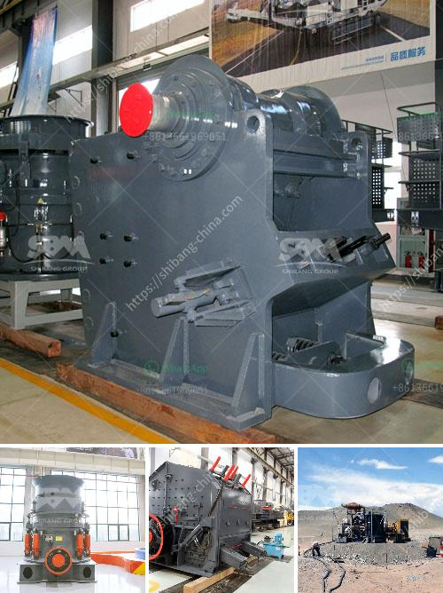

<h3>graphite production line</h3>
Graphite, a soft and versatile mineral, has gained immense popularity in various industries due to its unique properties. It is widely used in manufacturing lithium-ion batteries, construction materials, refractories, lubricants, and much more. As the demand for graphite continues to rise, the efficient production of this valuable mineral has become crucial. In this article, we will delve into the graphite production line, exploring the process from raw material to the finished product.

The graphite production line begins with the acquisition of the raw material: natural graphite or synthetic graphite. Natural graphite is typically mined from deposits around the world, while synthetic graphite is manufactured through a highly controlled process using petroleum coke as a precursor. Both types of graphite have their distinct advantages and applications.

Once the raw material is obtained, it is carefully processed to ensure high-quality graphite production. The first step involves crushing the graphite into smaller particles to facilitate subsequent steps. This process can be completed using various crushers, such as jaw crushers or impact crushers, depending on the size and hardness of the raw material.

Following crushing, the graphite undergoes grinding to achieve the desired particle size. The grinding process involves using mills, such as ball mills or Raymond mills, which rotate and grind the graphite particles into a fine powder. This powder is then classified based on the desired particle size distribution.

Next, the classified graphite powder is mixed with binders and additives to enhance its properties and ensure proper shaping during the subsequent steps. The mixture is then fed into a shaping machine, such as an extruder or a pelletizer, to form the graphite into desired shapes, such as rods, blocks, or electrodes.

After shaping, the graphite products go through a baking process called carbonization. Carbonization involves subjecting the shaped graphite to high temperatures in an oxygen-deprived environment, usually in a specialized furnace or kiln. This process eliminates impurities, converts the binders into carbon, and enhances the crystalline structure of the graphite.

To further improve the properties of the graphite, an optional step called graphitization can be employed. Graphitization involves heating the carbonized graphite to even higher temperatures, allowing the carbon atoms to reorganize into a highly ordered crystalline structure. This step greatly enhances the thermal and electrical conductivity, as well as the lubricating properties of the graphite.

Lastly, the graphite products are subjected to various finishing processes, such as machining, polishing, and coating, to meet specific requirements. These processes ensure that the graphite products have precise dimensions, smooth surfaces, and desired surface properties.

In conclusion, the production of graphite involves a series of labor-intensive processes to transform the raw material into a valuable finished product. From the acquisition of the raw material to the shaping, baking, and finishing stages, each step in the graphite production line plays a crucial role in achieving the desired graphite properties. As the demand for graphite continues to grow, advancements in production technology are essential to meet the evolving requirements of various industries.
<h3>Contact us</h3><ul><li><strong>Whatsapp:&nbsp;<a href="https://wa.me/8613661969651">+8613661969651</a></strong></li><li><a href="https://swt.shibang-china.com/?git&amp;zhl&amp;graphite production line"><strong>Online Service(chat now)</strong></a></li></ul><h3>Related</h3><ul><li><a href='how much does a quarry machine cost.md'>how much does a quarry machine cost</a></li><li><a href='industrial grinder in algeria.md'>industrial grinder in algeria</a></li><li><a href='roller crusher manufacturer.md'>roller crusher manufacturer</a></li><li><a href='bauxite processing plant.md'>bauxite processing plant</a></li><li><a href='cone crushers made in italy.md'>cone crushers made in italy</a></li></ul>