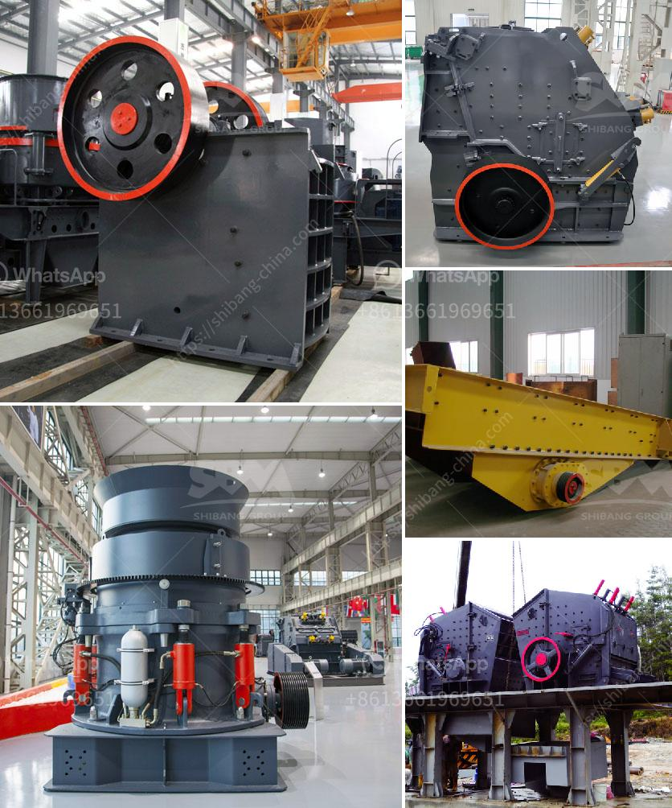

<h3>gravel belt conveyor rental toronto</h3>
In the bustling city of Toronto, construction projects are a common sight. With rapid urbanization and infrastructure development on the rise, the need for efficient construction equipment and machinery is paramount. Among the vital tools in construction sites, the gravel belt conveyor stands out for its ability to streamline the transportation of materials like gravel, sand, and other construction aggregates.

Gravel belt conveyor rental in Toronto is becoming an increasingly popular option for construction companies, both large and small. By opting for rental services instead of purchasing, companies can save substantial costs while still benefiting from the efficiency and versatility of this powerful machinery.

One of the primary advantages of gravel belt conveyor rentals is the enhanced productivity they offer. These conveyors are designed to quickly and effortlessly move large volumes of gravel, significantly reducing manual labour and increasing overall operational speed. By renting a gravel belt conveyor in Toronto, construction crews can easily transport material from one location to another, ensuring a smooth workflow and timely completion of projects.

Additionally, the flexibility of rental services allows construction companies to use gravel belt conveyors for specific tasks without the need for long-term investments. Whether it's a short-term project or a one-time requirement, renting a conveyor allows businesses to adjust their equipment needs according to the demands of individual projects. This eliminates the need for storage and maintenance, saving both money and valuable space in the long run.

Furthermore, renting a gravel belt conveyor in Toronto provides access to top-quality machinery without the associated ownership costs. Rental companies ensure that their equipment is well-maintained, regularly inspected, and complies with all safety regulations. This way, construction companies can focus on their projects and rely on the professional expertise of rental services to provide efficient and reliable equipment.

In conclusion, renting a gravel belt conveyor in Toronto has proven to be a sensible and cost-effective option for construction companies. With enhanced productivity, flexibility, and access to well-maintained machinery, rental services streamline construction projects and contribute to the overall success of the industry. By harnessing the power of gravel belt conveyors, construction crews can confidently tackle their projects, knowing they have the necessary tools at their disposal.
<h3>Contact us</h3><ul><li><strong>Whatsapp:&nbsp;<a href="https://wa.me/8613661969651">+8613661969651</a></strong></li><li><a href="https://swt.shibang-china.com/?git&amp;zhl&amp;gravel belt conveyor rental toronto"><strong>Online Service(chat now)</strong></a></li></ul><h3>Related</h3><ul><li><a href='portable coal crusher.md'>portable coal crusher</a></li><li><a href='used barite crusher price.md'>used barite crusher price</a></li><li><a href='super fine roller mill.md'>super fine roller mill</a></li><li><a href='mobile crushing alocation.md'>mobile crushing alocation</a></li><li><a href='sand and gravel dryer equipment qatar.md'>sand and gravel dryer equipment qatar</a></li></ul>