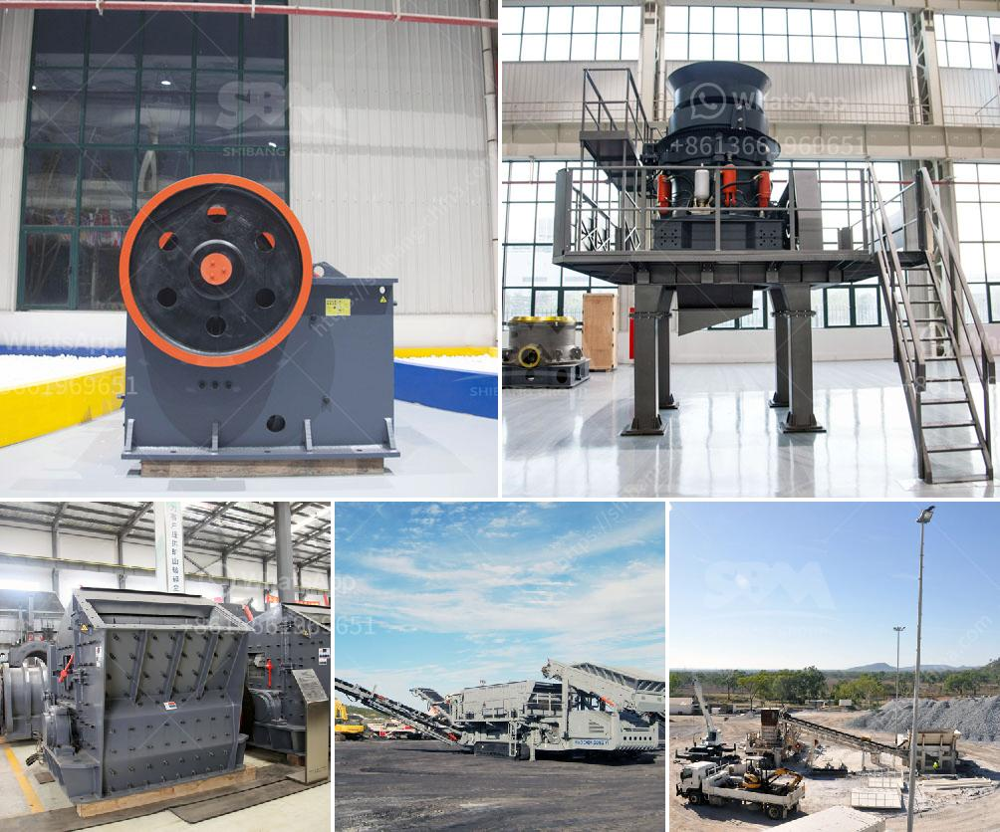

<h3>gravel crusher machinery</h3>
Gravel crushing is an inevitable part of construction and mining operations. Large rocks and boulders are broken down into smaller particles to be used in various construction purposes like concrete and asphalt. Gravel crusher machinery is pivotal for processing massive stones into manageable fragments.

Gravel crushing machinery comes in various types and specifications for different crushing applications. They are mainly used in primary, secondary, or tertiary crushing operations. Primary crushers are primary for a reason; they handle the first stage of crushing large stones up to 1 meter in diameter. Secondary crushers come after primary ones to further reduce the size of the stones, while tertiary crushers process the remaining stones into more manageable fragments.

Various types of gravel crusher machinery are available in the market to suit different crushing requirements. Jaw crushers, impact crushers, cone crushers, and gyratory crushers are commonly used for primary crushing. Cone and gyratory crushers are also used for secondary and tertiary crushing. Roll crushers and hammer mills are used for secondary and tertiary crushing for softer materials.

Jaw crushers are popular due to their ability to crush tough materials while providing a high reduction ratio. They consist of a fixed jaw plate and a movable jaw plate. The movable jaw moves back and forth against the fixed jaw, effectively crushing the stones.

Impact crushers utilize impact force to crush stones. They consist of a rotor that revolves at high speed, and upon impact with stones, the energy is transferred to the stones causing them to shatter into smaller fragments.

Cone crushers are suitable for secondary and tertiary crushing. They operate similarly to gyratory crushers but have a different shape in the crushing chamber. Cone crushers are ideal for producing cubical particles and are often used for the production of high-quality aggregates.

Gyratory crushers are primarily used for primary crushing. Like cone crushers, they also have a gyrating crushing head, but the crushing chamber is conical, which makes the crushing action more effective.

Roll crushers consist of rotating cylinders with two crushing rolls; one rotating inward and the other outward. They are primarily used for secondary and tertiary crushing of softer materials.

Hammer mills are used for secondary and tertiary crushing of softer materials such as limestone, gypsum, and clay. The material is fed into a rotating hammer rotor, where it is crushed and then discharged through screens.

Gravel crusher machinery plays a crucial role in reducing the size of gravels for various construction purposes. They are powerful machines that can handle large quantities of stones efficiently. Additionally, they offer different crushing options suitable for different types of rocks and materials.

In conclusion, gravel crusher machinery is essential equipment in construction and mining operations. It helps in breaking down large rocks and boulders into smaller fragments that can be used in various construction applications. Different types of machinery, such as jaw crushers, impact crushers, cone crushers, gyratory crushers, roll crushers, and hammer mills, are available to suit different crushing requirements. These machines ensure efficient crushing and reduction of stones, making them an integral part of any construction project.
<h3>Contact us</h3><ul><li><strong>Whatsapp:&nbsp;<a href="https://wa.me/8613661969651">+8613661969651</a></strong></li><li><a href="https://swt.shibang-china.com/?git&amp;zhl&amp;gravel crusher machinery"><strong>Online Service(chat now)</strong></a></li></ul><h3>Related</h3><ul><li><a href='limestone crusher india.md'>limestone crusher india</a></li><li><a href='recycled concrete crusher.md'>recycled concrete crusher</a></li><li><a href='processing plant for chrome for sale.md'>processing plant for chrome for sale</a></li><li><a href='widely used small stone jaw crusher crusher.md'>widely used small stone jaw crusher crusher</a></li><li><a href='300 tone per hour limestone crusher.md'>300 tone per hour limestone crusher</a></li></ul>