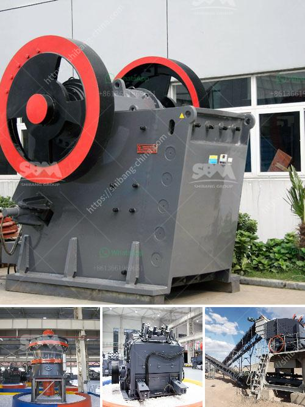

<h3>gravel crushing machine</h3>
Gravel crushing machines are essential in modern construction and road-building industry. These machines help achieve high quality aggregate needed in various infrastructure projects. With the booming market demand for gravel, along with the restricted depletion of natural resources, artificial gravel has become increasingly popular due to its availability, accessibility, and excellent performance.

Gravel is an important component of concrete and road construction, thus making gravel crushing machines vital for efficient and durable structures. As the leading supplier of gravel machines in China, we can provide customers with high-quality gravel crushing machines and professional services. In fact, since the establishment of the company, we have established strategic partnerships with many well-known machinery manufacturers to ensure the stable supply of equipment and provide customers with a wider range of choices.

So what makes our gravel crushing machines stand out from other suppliers? First and foremost is our advanced technology. We have invested heavily in research and development to create innovative and efficient gravel crushing machines. Our machines are designed to crush various types of rocks and ores into desired sizes, capable of handling materials ranging from soft limestone to hard granite. With adjustable crushing settings, our machines can produce aggregate of different sizes and shapes to meet specific project requirements.

Moreover, our gravel crushing machines are equipped with high quality wear parts, reducing the need for frequent replacements and allowing for longer machine life. This not only increases operational efficiency but also lowers maintenance costs, making our machines the best value for money.

Safety is another priority in our design process. Our gravel crushing machines are equipped with advanced safety devices that prevent accidents and protect operators from potential hazards. These safety features include emergency stop buttons, safety locks, and reinforced covers to ensure the safety of our operators.

In addition to the robustness and safety, our gravel crushing machines are also highly efficient and user-friendly. They can be easily operated by a single operator, reducing labor costs. The machines are equipped with user-friendly interfaces and intuitive controls, making them easy to learn and operate. Maintenance is also made simple, with easy access to all major components and regular maintenance routines being clearly specified in our user manuals.

In conclusion, gravel crushing machines play an important role in construction industry. as we become increasingly dependent on gravel and other aggregate materials for various construction purposes. Whether it is infrastructure projects, residential and commercial buildings, or even landscaping projects, gravel is essential for creating a solid foundation. Therefore, choosing the right gravel crushing machine is important to ensure efficient operations and maximum profitability. Our gravel crushing machines are reliable, efficient, and durable, offering exceptional value for money. With our advanced technology, excellent after-sales service, and commitment to customer satisfaction, we are confident that our gravel crushing machines will be a valuable asset to any construction project.
<h3>Contact us</h3><ul><li><strong>Whatsapp:&nbsp;<a href="https://wa.me/8613661969651">+8613661969651</a></strong></li><li><a href="https://swt.shibang-china.com/?git&amp;zhl&amp;gravel crushing machine"><strong>Online Service(chat now)</strong></a></li></ul><h3>Related</h3><ul><li><a href='price of artificial sand mill.md'>price of artificial sand mill</a></li><li><a href='stationary stone crushers made in china.md'>stationary stone crushers made in china</a></li><li><a href='manufacturer of quartz powder mill.md'>manufacturer of quartz powder mill</a></li><li><a href='buy crusher plant.md'>buy crusher plant</a></li><li><a href='dolomite ore processing.md'>dolomite ore processing</a></li></ul>