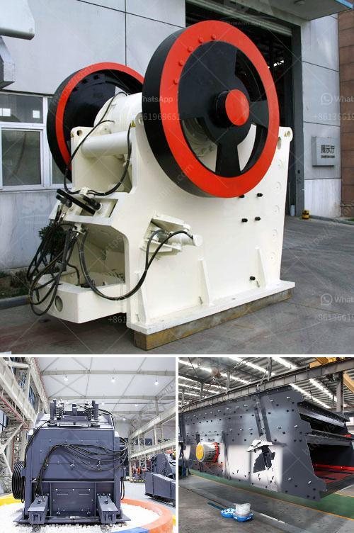

<h3>gravel pebbles mining south africa</h3>
Gravel pebbles mining in South Africa has been a major industry for several decades, providing crucial materials for construction and infrastructure development. The country boasts a wealth of gravel pebble deposits, primarily located in riverbeds, resulting from erosion and sedimentation over centuries.

South Africa's gravel pebbles are mainly composed of quartzite, a hard and durable mineral that makes it a desirable material for various applications. The mining of these pebbles involves the extraction and processing of these mineral-rich deposits to meet the growing demand for construction materials.

One of the significant advantages of gravel pebbles mining in South Africa is its low environmental impact. Unlike other forms of mining that require extensive excavation or blasting, the extraction of gravel pebbles is relatively straightforward, involving sifting through riverbeds using specialized equipment. This minimizes the disturbance to the surrounding ecosystems and reduces the carbon footprint associated with mining activities.

Moreover, South Africa's gravel pebbles mining industry has played a vital role in driving economic development and job creation. These mining operations have provided employment opportunities for thousands of individuals living in rural areas, where alternatives for sustainable livelihoods are often limited. This not only reduces unemployment but also contributes to poverty alleviation and socioeconomic upliftment in these communities.

The extracted gravel pebbles serve as essential materials in various construction projects throughout South Africa. They are used in road and building construction, concrete production, landscaping, and as decorative elements in gardens and public spaces. The durability and aesthetic appeal of these pebbles make them highly sought after, both locally and internationally.

In recent years, the demand for gravel pebbles from South Africa has grown significantly. Their versatility and wide range of applications have made them an indispensable resource in the construction industry. The surge in infrastructure development projects, such as roads, bridges, and housing, has further fueled the demand for these materials.

To meet the rising demand, mining companies in South Africa have invested in modern equipment and technologies to extract gravel pebbles more efficiently. Additionally, sustainable mining practices have been emphasized to ensure the responsible use of natural resources and minimize negative environmental impacts.

The mining industry in South Africa faces its own set of challenges, such as regulatory compliance, proper land rehabilitation, and responsible water usage. However, efforts are being made to address these issues and strike a balance between economic development and environmental stewardship.

In conclusion, gravel pebbles mining holds immense importance for South Africa's construction industry and overall economic growth. The country's abundant mineral deposits, coupled with its low environmental impact, make it an attractive source of valuable materials. The industry has not only provided employment opportunities but also played a significant role in infrastructure development, contributing to the country's progress and prosperity. As responsible mining practices continue to be adopted, the gravel pebbles mining industry in South Africa has a promising future ahead.
<h3>Contact us</h3><ul><li><strong>Whatsapp:&nbsp;<a href="https://wa.me/8613661969651">+8613661969651</a></strong></li><li><a href="https://swt.shibang-china.com/?git&amp;zhl&amp;gravel pebbles mining south africa"><strong>Online Service(chat now)</strong></a></li></ul><h3>Related</h3><ul><li><a href='grinding mill gold ore.md'>grinding mill gold ore</a></li><li><a href='small scale mining rock crushers for sale.md'>small scale mining rock crushers for sale</a></li><li><a href='trapizium mill for purvelising.md'>trapizium mill for purvelising</a></li><li><a href='mill gypsum for sale in india.md'>mill gypsum for sale in india</a></li><li><a href='used gold washer machine plant.md'>used gold washer machine plant</a></li></ul>