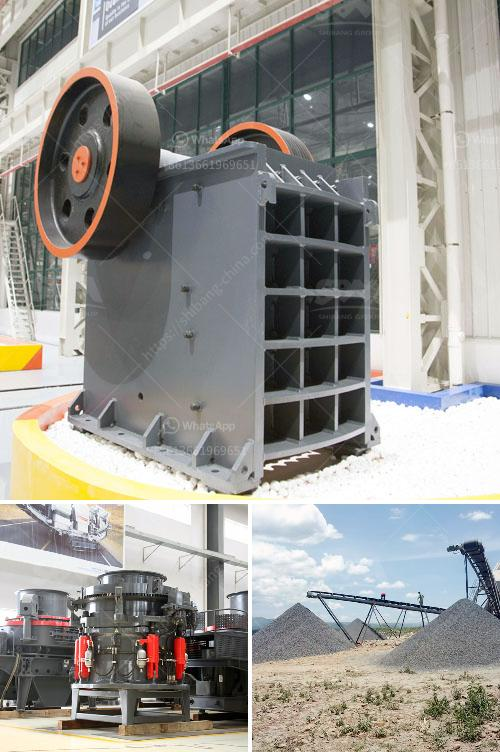

<h3>gravel sand wash plants canada for sale</h3>
Gravel sand wash plants are essential when it comes to separating sand particles from gravel and various aggregates. They are commonly used in construction projects, such as road and building foundations, to ensure proper drainage and stability. Canada, being a country known for its vast natural resources and booming construction industry, offers a wide range of gravel sand wash plants for sale.

One significant advantage of gravel sand wash plants in Canada is that they are designed to efficiently and effectively clean and separate the sand particles from unwanted debris. These plants typically consist of multiple components, including a feed hopper, a conveyor system, a rotary screen, and a sand recovery unit. The feed hopper collects the raw materials, which are then transferred to the conveyor system. The conveyor system transports the materials to the rotary screen, where the sand and gravel particles are separated based on size.

During the separation process, water is used to clean the sand and remove any impurities or contaminants. The water is continuously circulated and reused within the system, making gravel sand wash plants in Canada both eco-friendly and cost-effective. The sand recovery unit plays a crucial role in this process, collecting the clean sand and discharging the waste and unwanted debris.

Gravel sand wash plants in Canada are available in various sizes and capacities to accommodate different project requirements. Whether it's a small-scale residential construction project or a large-scale infrastructure development, there is a wash plant available for every need. Additionally, these plants can be easily customized to meet specific site conditions and operational preferences.

When considering the purchase of a gravel sand wash plant in Canada, it is important to choose a reputable supplier with a track record of delivering high-quality equipment. The supplier should offer comprehensive after-sales support, including installation, training, and maintenance services. It is also advisable to select a wash plant that is energy efficient and equipped with advanced technologies to maximize productivity and minimize operational costs.

In conclusion, gravel sand wash plants in Canada play a vital role in the construction industry by efficiently separating sand particles from gravel and aggregates. With their eco-friendly design and customizable options, these plants are a smart investment for both small and large-scale projects. Whether you are a contractor or a property owner, finding the right gravel sand wash plant for sale in Canada will ensure the success and longevity of your construction endeavors.
<h3>Contact us</h3><ul><li><strong>Whatsapp:&nbsp;<a href="https://wa.me/8613661969651">+8613661969651</a></strong></li><li><a href="https://swt.shibang-china.com/?git&amp;zhl&amp;gravel sand wash plants canada for sale"><strong>Online Service(chat now)</strong></a></li></ul><h3>Related</h3><ul><li><a href='raymond mill parts.md'>raymond mill parts</a></li><li><a href='calcite milling equipment for sale.md'>calcite milling equipment for sale</a></li><li><a href='fuller traylor nt gyratory crusher manual.md'>fuller traylor nt gyratory crusher manual</a></li><li><a href='50 tpd cement plant manufacturer in china.md'>50 tpd cement plant manufacturer in china</a></li><li><a href='coal mining prices machines.md'>coal mining prices machines</a></li></ul>