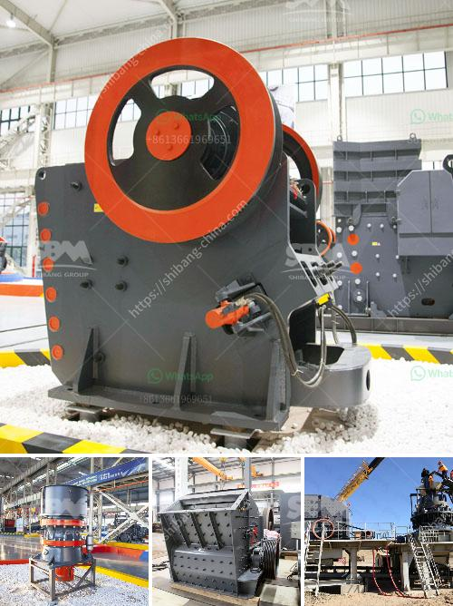

<h3>gravel vibrating screen</h3>
Gravel is one of the most important building materials used in construction projects around the world. However, the processing and handling of gravel requires efficient and reliable equipment, such as a gravel vibrating screen, to ensure that the material meets the required specifications.

A gravel vibrating screen is a piece of equipment that is typically used in the mining industry to separate aggregate materials based on size. Vibrating screens enable miners to classify raw materials accurately and efficiently, ultimately resulting in higher quality products.

The primary function of a gravel vibrating screen is to sort and separate materials into different sizes. This is accomplished by using a series of vibrating screens with different sized mesh openings. As the material is fed onto the top screen, larger particles are retained on the screen surface, while smaller particles fall through the openings. Multiple screens with progressively smaller openings are used to separate the material into various sizes.

The vibrating motion of the screens helps to prevent material clogging, ensuring continuous operation and high productivity. It also helps to remove any excess moisture from the gravel, enhancing its quality. The amplitude and frequency of the vibrations can be adjusted to optimize the screening process for different types of gravel and production requirements.

One of the key advantages of a gravel vibrating screen is its versatility. It can be used in a wide range of applications, including screening aggregates, sorting crushed stones, and even processing recycled materials. This makes it an essential piece of equipment for construction companies, quarries, and mining operations.

Another significant advantage of using a gravel vibrating screen is the ability to customize the screen deck configuration. Manufacturers offer a variety of screen types, including woven wire mesh, punched plate, and polyurethane, to meet specific requirements. This allows operators to tailor the screen to the type of material being processed, thereby achieving optimal screening performance.

Additionally, many modern gravel vibrating screens are equipped with advanced features to enhance efficiency and reduce maintenance. For example, some screens are designed with modular decks that can be easily replaced or interchanged. This minimizes downtime and allows operators to quickly switch between different screening applications.

Regular maintenance and inspections are crucial to ensure the longevity and performance of a gravel vibrating screen. Proper cleaning and lubrication of the components, as well as regular inspections for worn parts, are essential. By following the manufacturer's maintenance guidelines, operators can maximize the screen's lifespan and minimize unplanned downtime.

In conclusion, a gravel vibrating screen is an indispensable piece of equipment in material processing and handling. Its ability to classify materials accurately and efficiently plays a vital role in ensuring the quality and consistency of the end product. With its versatility, customization options, and advanced features, a gravel vibrating screen offers businesses in the mining, construction, and quarrying industries an efficient solution to their screening needs.
<h3>Contact us</h3><ul><li><strong>Whatsapp:&nbsp;<a href="https://wa.me/8613661969651">+8613661969651</a></strong></li><li><a href="https://swt.shibang-china.com/?git&amp;zhl&amp;gravel vibrating screen"><strong>Online Service(chat now)</strong></a></li></ul><h3>Related</h3><ul><li><a href='ball mill company in tamilnadu.md'>ball mill company in tamilnadu</a></li><li><a href='quartz ball for ball milling.md'>quartz ball for ball milling</a></li><li><a href='talcum powder suppliers factories.md'>talcum powder suppliers factories</a></li><li><a href='setup for limestone crusher plant.md'>setup for limestone crusher plant</a></li><li><a href='granite quarry crusher in nigeria.md'>granite quarry crusher in nigeria</a></li></ul>