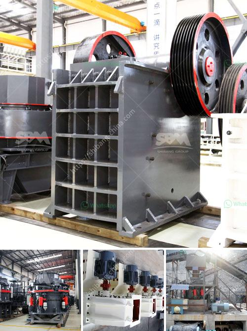

<h3>grinding a stone crusher</h3>
Stone crushers are commonly used on construction sites and in stone quarries to crush large stones into smaller pieces. Crushed rock has a variety of purposes, but is often used to make level surfaces, provide drainage under roads and buildings, or to create gravel roads. Stone crusher units have huge requirements for crushing materials and grinding, whether it's igneous, metamorphic, or sedimentary rocks. Stone crushers can process natural rock into gravel, aggregates, and sand quickly and efficiently.

In this article, we'll delve into the process of grinding a stone crusher and highlight the various steps you need to take to effectively refine and transform raw materials into usable aggregates.

Choosing the right crusher is the most important step as it determines the final product's quality. Different crushers have different crushing capabilities and potential applications. For example, a jaw crusher is suitable for primary crushing while a cone crusher is considered ideal for secondary or tertiary crushing. Analyze your project requirements and consult with experts to select the most appropriate stone crusher for your specific needs.

Before you begin the grinding process, inspect the machine thoroughly to ensure that all the components are in good working condition. Check the belts, bearings, and other critical parts for any signs of wear or damage. Proper maintenance and regular servicing of the stone crusher can significantly extend its lifespan and ensure optimum performance.

Before grinding the stone crusher, it is essential to prepare the raw materials by feeding them into the crusher evenly and gradually. Use a vibrating feeder or other types of feeding equipment to control the feed rate and regulate the size of the materials entering the crusher.

Adjust the crusher settings to achieve the desired product size and shape. Depending on the end-use requirements, you may need to set different parameters such as the crusher's CSS (Closed Side Setting) or the crusher's speed. These parameters control how the crushers' jaws or cones interact with each other, determining the final product size.

Once the crusher settings are configured, start the machine and monitor its performance. Ensure that there are no blockages or irregularities during the grinding process. As the stones are crushed, they should move smoothly through the crusher and exit through the discharge chute.

While the crusher is running, regularly inspect and monitor its performance, paying special attention to the power consumption, noise level, and vibration. Address any issues promptly to prevent further damage or downtime. Additionally, lubricate all moving parts regularly to ensure smooth operation.

As the stone crusher grinds the rocks, collect the resulting aggregates and store them appropriately. Use a screen or a stone washing system to separate the different sizes of aggregates and remove any impurities or unwanted materials. This will ensure that the final product meets the required specifications and standards.

In conclusion, grinding a stone crusher is a complex task that requires careful planning, attention to detail, and proper execution. By following the steps outlined in this article, you can effectively refine and transform raw materials into valuable aggregates for various construction purposes. Remember to prioritize safety and regular maintenance to keep the stone crusher running smoothly and efficiently for years to come.
<h3>Contact us</h3><ul><li><strong>Whatsapp:&nbsp;<a href="https://wa.me/8613661969651">+8613661969651</a></strong></li><li><a href="https://swt.shibang-china.com/?git&amp;zhl&amp;grinding a stone crusher"><strong>Online Service(chat now)</strong></a></li></ul><h3>Related</h3><ul><li><a href='coal powder making machine.md'>coal powder making machine</a></li><li><a href='jaw crusher new design.md'>jaw crusher new design</a></li><li><a href='coal grinding plant.md'>coal grinding plant</a></li><li><a href='mobile crushing plant for limestone.md'>mobile crushing plant for limestone</a></li><li><a href='barite rock mill.md'>barite rock mill</a></li></ul>