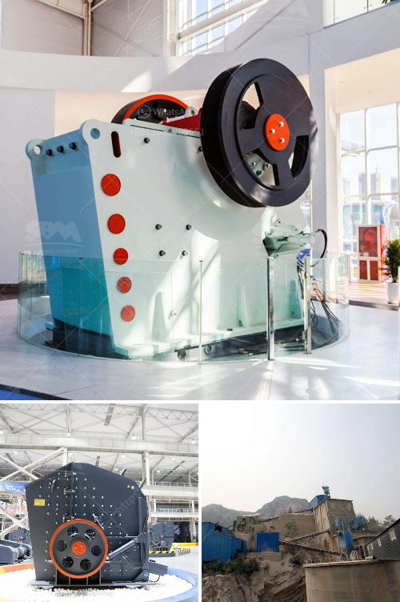

<h3>grinding and packing machines in pakistan</h3>
The manufacturing industry has always been a vital sector of any nation's economy. In Pakistan, this sector contributes significantly to the GDP and provides employment opportunities to a large portion of the population. To cope with the ever-increasing demands of the market, manufacturers in Pakistan heavily rely on efficient grinding and packing machines. These machines not only ensure the production of high-quality products but also increase the overall operational efficiency of the manufacturing process.

Grinding machines play a crucial role in transforming raw materials into finely ground powders or pastes that can be further processed. They are widely used in various industries including food processing, pharmaceuticals, and construction. In Pakistan, these machines are particularly vital in industries such as spice grinding, cereals processing, and oil milling.

The spice grinding industry in Pakistan is booming due to the increasing demand for flavorful and aromatic spices. To cater to this demand, grinding machines are widely used to grind whole spices into powdered form. They enable manufacturers to produce spices in large quantities while preserving their quality and taste.

Similarly, in the cereals processing industry, grinding machines ensure the production of uniformly ground products such as flour, semolina, and cornmeal. These machines have significantly reduced the manual labor required, resulting in increased productivity and reduced production costs.

The oil milling industry in Pakistan heavily relies on grinding machines to extract oil from various oilseeds. These machines crush and process oilseeds to obtain oil, which is then further refined and packed. The use of grinding machines in this industry has led to higher oil extraction rates and increased profitability for manufacturers.

While grinding machines are essential, packing machines play an equally crucial role in the manufacturing industry. These machines help in packaging products efficiently, ensuring their safety, and preserving their quality. In Pakistan, packing machines are extensively used in industries such as food and beverage, pharmaceuticals, and FMCG (Fast-Moving Consumer Goods).

In the food and beverage industry, packing machines enable manufacturers to package their products in various forms such as bottles, cans, pouches, or cartons. These machines ensure the correct measurement, sealing, and labeling of products, eliminating human errors and ensuring consistency in product quality.

The pharmaceutical industry heavily relies on packing machines to ensure the safe and hygienic packaging of medicines. These machines are equipped with advanced technology to accurately package medicines in the required quantities, protecting them from contamination and maintaining their efficacy.

In the FMCG sector, packing machines are widely used to package products such as detergents, toiletries, and household items. These machines not only increase the speed of packaging but also reduce the costs associated with manual labor, thereby improving the overall profitability of the manufacturers.

In conclusion, grinding and packing machines have revolutionized the manufacturing industry in Pakistan. They have significantly improved the productivity, efficiency, and profitability of various sectors, including spice grinding, cereals processing, oil milling, food and beverage, pharmaceuticals, and FMCG. With the increasing demand for high-quality products, the utilization of these machines has become imperative for manufacturers to stay competitive in the market.
<h3>Contact us</h3><ul><li><strong>Whatsapp:&nbsp;<a href="https://wa.me/8613661969651">+8613661969651</a></strong></li><li><a href="https://swt.shibang-china.com/?git&amp;zhl&amp;grinding and packing machines in pakistan"><strong>Online Service(chat now)</strong></a></li></ul><h3>Related</h3><ul><li><a href='jaw crusher in uae.md'>jaw crusher in uae</a></li><li><a href='gravel belt conveyor rental toronto.md'>gravel belt conveyor rental toronto</a></li><li><a href='coal crusher hammer.md'>coal crusher hammer</a></li><li><a href='manufacturers of coal mill in india.md'>manufacturers of coal mill in india</a></li><li><a href='georgia country stone crusher.md'>georgia country stone crusher</a></li></ul>