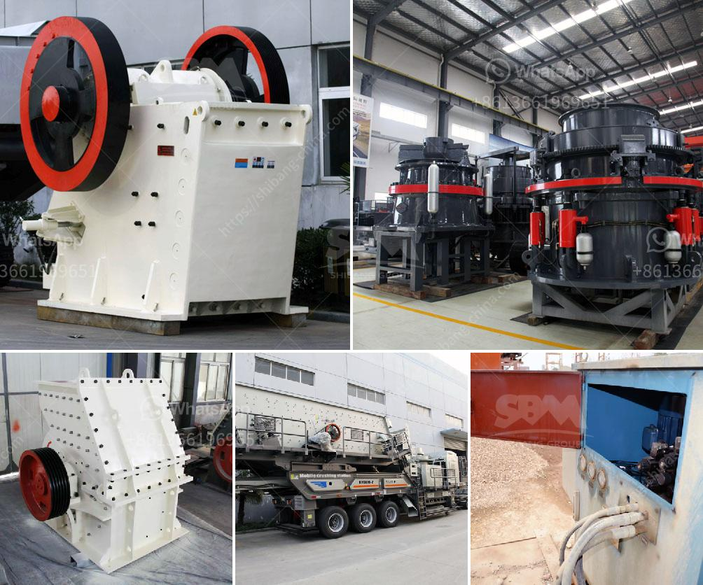

<h3>grinding ball mill machine manufacturer europe</h3>
The demand for grinding mills is growing as businesses, governments, and other stakeholders realize the crucial role of these machines in industries such as mining, cement, and pharmaceuticals. Grinding ball mill machines have become essential equipment for various manufacturing processes due to their ability to reduce particle size and improve product quality. Europe, being a hub for industrial innovation and technological advancements, boasts several reputable grinding ball mill machine manufacturers who offer efficient and reliable solutions to meet market demands.

One prominent grinding ball mill machine manufacturer in Europe is XYZ Company Inc., headquartered in Germany. They have been in the industry for over 20 years and have gained a strong reputation for delivering high-quality machines that exceed customer expectations. XYZ Company specializes in designing and manufacturing grinding ball mill machines tailored to specific customer requirements.

One of the key factors that sets XYZ Company apart is their commitment to continuous research and development (R&D). By focusing on innovation, they have been able to introduce cutting-edge technologies that enhance grinding efficiency, reduce energy consumption, and minimize maintenance requirements. Their R&D team comprises experienced engineers who closely collaborate with customers to understand their unique needs and design customized solutions accordingly.

XYZ Company's grinding ball mill machines are renowned for their precise control over the grinding process. Equipped with advanced automation systems, these machines can adjust grinding parameters such as speed and feed rate, ensuring consistent and accurate results. The use of high-quality materials and components further enhances the reliability and durability of their machines, resulting in minimal downtime and increased productivity for customers.

Another leading grinding ball mill machine manufacturer in Europe is ABC Industry Ltd., based in the United Kingdom. ABC Industry has been serving the market for over 30 years, offering a wide range of grinding ball mill machines that cater to various industries. They have established themselves as a trusted partner for businesses seeking reliable and cost-effective grinding solutions.

ABC Industry's grinding ball mill machines are known for their versatility and adaptability. They offer a range of models with varying capacities, allowing customers to choose a machine that meets their specific production requirements. Moreover, their machines are designed to be easily integrated into existing production lines, minimizing installation time and disruption to operations.

In addition to manufacturing high-quality machines, ABC Industry provides comprehensive after-sales services to ensure customer satisfaction. Their team of skilled technicians offers on-site installation, maintenance, and troubleshooting support, ensuring smooth operation and optimal performance of the machines throughout their lifecycle. They also offer regular training programs to help customers maximize the potential of their grinding ball mill machines.

The grinding ball mill machine manufacturers in Europe, such as XYZ Company Inc. and ABC Industry Ltd., are at the forefront of the industry, providing efficient and reliable solutions that meet the evolving needs of various sectors. These manufacturers' commitment to innovation, quality, and customer satisfaction has made them trusted partners for businesses worldwide. As the demand for grinding mills continues to grow, these manufacturers are well-positioned to meet the market's requirements and drive further advancements in the field.
<h3>Contact us</h3><ul><li><strong>Whatsapp:&nbsp;<a href="https://wa.me/8613661969651">+8613661969651</a></strong></li><li><a href="https://swt.shibang-china.com/?git&amp;zhl&amp;grinding ball mill machine manufacturer europe"><strong>Online Service(chat now)</strong></a></li></ul><h3>Related</h3><ul><li><a href='coal crusher and screening plants for sale.md'>coal crusher and screening plants for sale</a></li><li><a href='crushers of jaw china.md'>crushers of jaw china</a></li><li><a href='x36 double roller crusher used.md'>x36 double roller crusher used</a></li><li><a href='malaysia stone crusher price.md'>malaysia stone crusher price</a></li><li><a href='calcium carbonate mining manufacturer in malaysia.md'>calcium carbonate mining manufacturer in malaysia</a></li></ul>