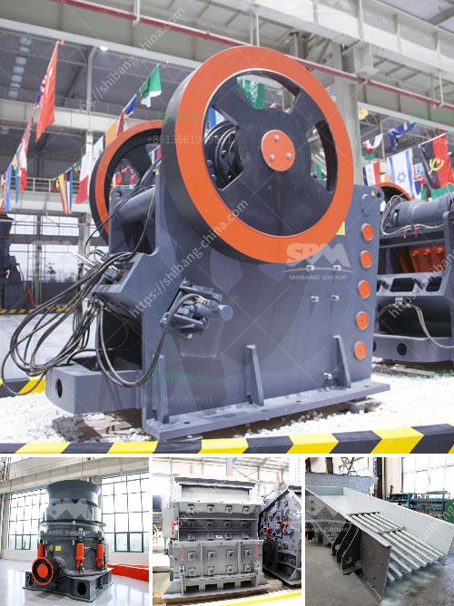

<h3>grinding machine manufacturers from europe</h3>
Grinding machines are indispensable tools in the manufacturing industry, which are used to grind workpieces to high precision levels. Grinding machines come in various types and sizes, with different specifications and capabilities, and are commonly used in industries such as automotive, aerospace, mechanical engineering, tool manufacturing, and many others.

Europe has a strong presence in the global grinding machine market, with several leading manufacturers based in the region. European grinding machine manufacturers are renowned for their technological advancements in machinery production, and their ability to produce high-quality equipment that meets the needs of their customers.

One of the prominent European grinding machine manufacturers is Danobatgroup, headquartered in Spain. With over 65 years of experience in the industry, Danobatgroup offers a wide range of grinding machines that cater to various applications, including cylindrical and surface grinding, as well as turning and milling machines. Their cutting-edge technology and commitment to innovation have positioned them as one of the top players in the market.

Another reputable European manufacturer is Vollmer, based in Germany. Vollmer specializes in producing grinding and sharpening machines for a wide range of industries, including sawmills, metalworking, and woodworking. Their machines are widely recognized for their precision, reliability, and durability, making them a popular choice among manufacturers.

In Italy, MVM S.r.l. is a leading manufacturer of industrial grinding machines, particularly for the paper, plastic, and woodworking industries. With a comprehensive range of products, including grinding machines for circular and straight knives, as well as sharpening and polishing machines, MVM S.r.l. has established itself as a reliable partner for many companies.

Overall, European grinding machine manufacturers excel in producing high-quality, precision machinery for various industries. Their commitment to innovation, advanced technology, and customer satisfaction has enabled them to carve a niche in the global market. With their expertise and continuous development efforts, European manufacturers are likely to continue leading the way in the grinding machine industry for years to come.
<h3>Contact us</h3><ul><li><strong>Whatsapp:&nbsp;<a href="https://wa.me/8613661969651">+8613661969651</a></strong></li><li><a href="https://swt.shibang-china.com/?git&amp;zhl&amp;grinding machine manufacturers from europe"><strong>Online Service(chat now)</strong></a></li></ul><h3>Related</h3><ul><li><a href='crushing plant in maule.md'>crushing plant in maule</a></li><li><a href='quote industrial mill quote ball mills.md'>quote industrial mill quote ball mills</a></li><li><a href='machinery for quartz stone.md'>machinery for quartz stone</a></li><li><a href='rubble crushing machine.md'>rubble crushing machine</a></li><li><a href='barite rock mill.md'>barite rock mill</a></li></ul>