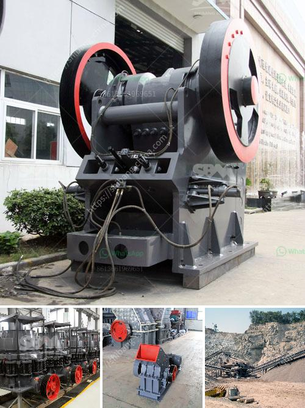

<h3>grinding machine parts and their functions</h3>
Grinding machines are integral components of an industrial manufacturing process, mainly used for reducing the size of various materials. However, their underlying functions and actions are not well understood or appreciated by the general public. This article aims to educate the reader about grinding machine parts and their functions.

The grinding machine comprises of a bed with a fixed guide for a workpiece and a power-driven wheel that spins at a predetermined speed. The head of a grinding machine can be moved along the bed in a longitudinal and transverse direction, allowing the machine to grind and shape the material as desired.

A grinding wheel, also known as an abrasive wheel, consists of abrasive particles bonded together in a matrix-like structure. This wheel is used for various grinding and abrasive machining operations. Grinding wheels are made from a range of abrasive materials such as aluminum oxide, silicon carbide, or diamond. The selection of the abrasive material depends on the nature of the workpiece and the desired finish.

The base or bed of a grinding machine is similar to a workbench upon which the material to be ground is placed. The bed provides support and stability to the workpiece during the grinding process. It is typically made of cast iron or steel and is designed to minimize vibrations.

The headstock is an essential part of the grinding machine that holds and rotates the grinding wheel. It contains a spindle, control levers, and various adjustments for precision grinding. The spindle is responsible for rotating the grinding wheel at a precise speed, ensuring the desired finish is achieved. Control levers allow for adjustments in terms of speed, rotation direction, and wheel positioning.

The wheel guard or shield is a safety feature that covers the grinding wheel, protecting the operator from any debris or fragments that may be thrown off during the grinding process. The guard also serves to contain any sparks or embers generated during the grinding operation, thus preventing potential accidents or fires.

The grinding machine also includes an electric motor that provides power to rotate the grinding wheel. The motor may be a single-phase or three-phase motor, depending on the requirements of the machine. It is typically connected to the driving mechanism of the grinding machine, ensuring smooth and efficient operation.

Other components of a grinding machine may include coolant nozzles, which provide a flow of coolant to cool and lubricate the grinding wheel and workpiece. Coolant is essential to prevent the material from overheating, reducing the risk of damage to both the workpiece and the grinding machine.

In conclusion, grinding machines are complex pieces of equipment with various components and functions. Understanding the different parts and their roles in the grinding process can help operators and maintenance technicians optimize machine performance and ensure the longevity of the equipment. Whether it is the bed, headstock, wheel guard, or electric motor, each part plays a vital role in achieving the desired finish and maintaining operator safety.
<h3>Contact us</h3><ul><li><strong>Whatsapp:&nbsp;<a href="https://wa.me/8613661969651">+8613661969651</a></strong></li><li><a href="https://swt.shibang-china.com/?git&amp;zhl&amp;grinding machine parts and their functions"><strong>Online Service(chat now)</strong></a></li></ul><h3>Related</h3><ul><li><a href='forno paragon para venda.md'>forno paragon para venda</a></li><li><a href='project report on concrete crusher pdf.md'>project report on concrete crusher pdf</a></li><li><a href='gypsum processing line.md'>gypsum processing line</a></li><li><a href='crusehr processing plant malaysia.md'>crusehr processing plant malaysia</a></li><li><a href='gypsum portland cement retarder manufacturer usa.md'>gypsum portland cement retarder manufacturer usa</a></li></ul>