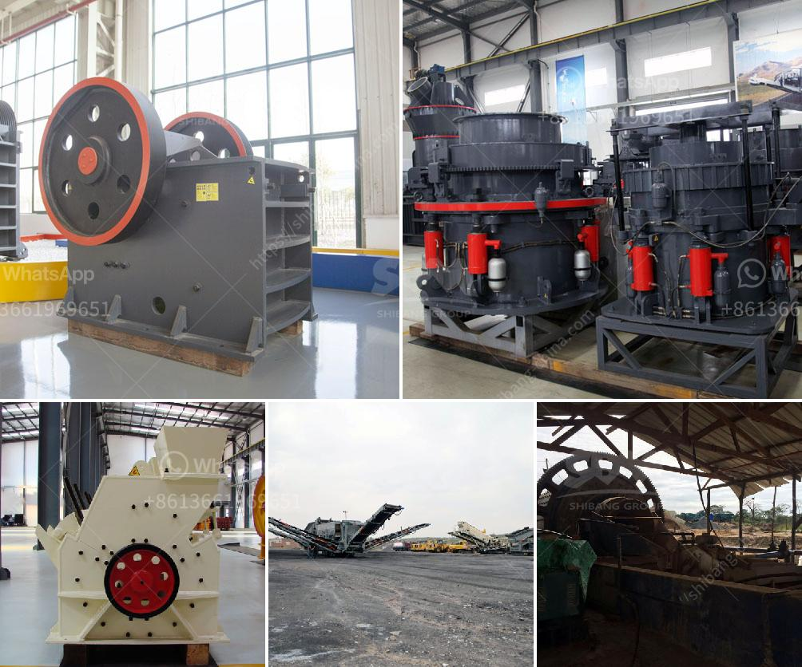

<h3>grinding machines for brick</h3>
Grinding machines have been widely used in the construction industry for many years, helping contractors improve the quality of their brickwork and achieve greater efficiency when building new structures. These machines are essential for grinding, leveling, and polishing concrete or stone surfaces, allowing contractors to finish projects smoothly and to a high standard.

When it comes to grinding machines, most people often think of concrete grinding machines used for grinding concrete floors. However, there are also grinding machines designed for brick materials, which are used to remove paint, scratches, and other imperfections from bricks, resulting in beautiful and uniform brick surfaces.

One of the main advantages of using grinding machines for brickwork is that they enable contractors to prepare the bricks for various applications. Whether it's for brick repointing, brick restoration, or simply to create a more polished and refined look, these machines can efficiently grind away any unwanted materials on the brick surface.

Grinding machines for bricks come in various shapes and sizes, depending on the specific application. The most common types include angle grinders, planetary grinders, and diamond grinders. Angle grinders are handheld tools that can be used for grinding and polishing brickwork. They are versatile and easy to use, making them a popular choice among contractors.

Planetary grinders, on the other hand, are larger and more powerful machines. They consist of multiple rotating heads that move in different directions, allowing for more efficient and even grinding on larger surfaces. These machines are particularly useful for grinding large areas of brickwork or for removing stubborn materials such as old paint or adhesive.

Diamond grinders are another type of grinding machine commonly used for brickwork. They use diamond-impregnated discs, which are extremely durable and can effectively grind away any unwanted materials on the brick surface. Diamond grinders are highly efficient and can produce a smooth and polished finish on bricks.

Using grinding machines for brickwork offers many benefits for contractors. Firstly, it saves time and effort by eliminating the need for manual grinding using traditional tools. With grinding machines, contractors can complete large-scale brickwork projects in a shorter amount of time, improving overall productivity and project efficiency.

Moreover, grinding machines result in a more uniform and professional finish on brick surfaces. By removing imperfections, such as paint or scratches, contractors can achieve a consistent and aesthetically pleasing look across all bricks used in a structure. This ultimately enhances the overall appearance and quality of the construction project.

In conclusion, grinding machines are valuable tools for contractors working with brick materials. They offer a range of benefits, including time-saving, improved efficiency, and enhanced quality of brickwork. By investing in these machines, contractors can ensure that their construction projects meet the highest standards, resulting in buildings that stand the test of time and look visually appealing.
<h3>Contact us</h3><ul><li><strong>Whatsapp:&nbsp;<a href="https://wa.me/8613661969651">+8613661969651</a></strong></li><li><a href="https://swt.shibang-china.com/?git&amp;zhl&amp;grinding machines for brick"><strong>Online Service(chat now)</strong></a></li></ul><h3>Related</h3><ul><li><a href='raymond mill mumbai and africa.md'>raymond mill mumbai and africa</a></li><li><a href='hammer mills for granite.md'>hammer mills for granite</a></li><li><a href='gypsum crushing plant price in pakistan.md'>gypsum crushing plant price in pakistan</a></li><li><a href='vertical hammer crusher.md'>vertical hammer crusher</a></li><li><a href='copper processing plants in usa for sale.md'>copper processing plants in usa for sale</a></li></ul>