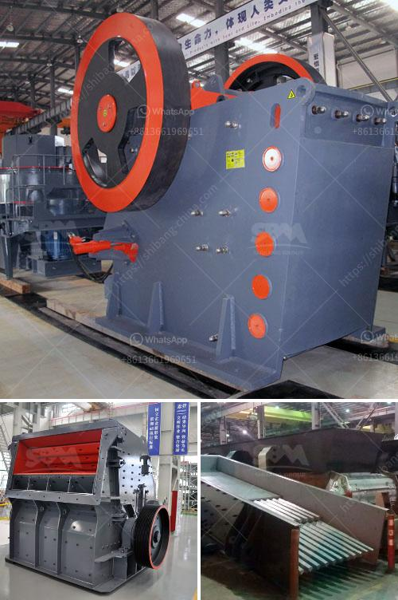

<h3>grinding machines for clay</h3>
Clay is a widely versatile material used in various industries such as ceramics, construction, and agriculture. However, harnessing its full potential requires proper processing. One vital piece of equipment that optimizes clay processing is a grinding machine.

Grinding machines have been instrumental in revolutionizing the way clay can be processed and utilized. These machines transform raw clay into fine powder or granules, ensuring that its physical properties are optimized for different applications.

One of the key advantages of grinding machines for clay is their ability to produce consistent particle sizes. By regulating the machine settings, manufacturers can obtain uniform particle sizes, leading to better product quality. This is crucial in industries like ceramics, where consistent clay particle size guarantees the desired properties for molding and firing.

Furthermore, grinding machines enable greater control over the range of particle sizes produced. Different applications demand specific particle size distributions, and grinding machines can efficiently achieve this. Industries such as agriculture use clay with customized particle sizes for soil conditioning, seed coating, and animal feed supplements.

Another benefit of grinding machines is their ability to enhance clay's performance. By reducing the clay particles' size, grinding machines increase the material's surface area. This increased surface area allows for better mixing and binding properties, making it easier to incorporate clay into various formulations like paints, adhesives, and sealants.

Moreover, grinding machines greatly enhance the efficiency of clay processing. Compared to manual crushing or milling, grinding machines offer faster and more precise clay processing. This not only saves time but also reduces labor costs, making the entire process more cost-effective.

It is important to note that grinding machines for clay come in different types and configurations, each designed to fulfill specific requirements. Some machines are designed for wet grinding, while others accommodate dry grinding. Furthermore, the choice of grinding machine depends on factors such as the required particle size range, clay's moisture content, and the processing capacity needed.

In conclusion, grinding machines have revolutionized clay processing and utilization in various industries. Their ability to produce consistent particle sizes, enhance clay's properties, and improve production efficiency makes them indispensable. Whether it's ceramics, construction, or agriculture, the use of grinding machines allows manufacturers to unlock the full potential of clay and explore new horizons of opportunities.
<h3>Contact us</h3><ul><li><strong>Whatsapp:&nbsp;<a href="https://wa.me/8613661969651">+8613661969651</a></strong></li><li><a href="https://swt.shibang-china.com/?git&amp;zhl&amp;grinding machines for clay"><strong>Online Service(chat now)</strong></a></li></ul><h3>Related</h3><ul><li><a href='stone crusher machine germany.md'>stone crusher machine germany</a></li><li><a href='gypsum recycling plant cost.md'>gypsum recycling plant cost</a></li><li><a href='used rock crushing plant for sale in uae.md'>used rock crushing plant for sale in uae</a></li><li><a href='jaw crusher single toggle.md'>jaw crusher single toggle</a></li><li><a href='coal fired power plants contractors in vietnam.md'>coal fired power plants contractors in vietnam</a></li></ul>