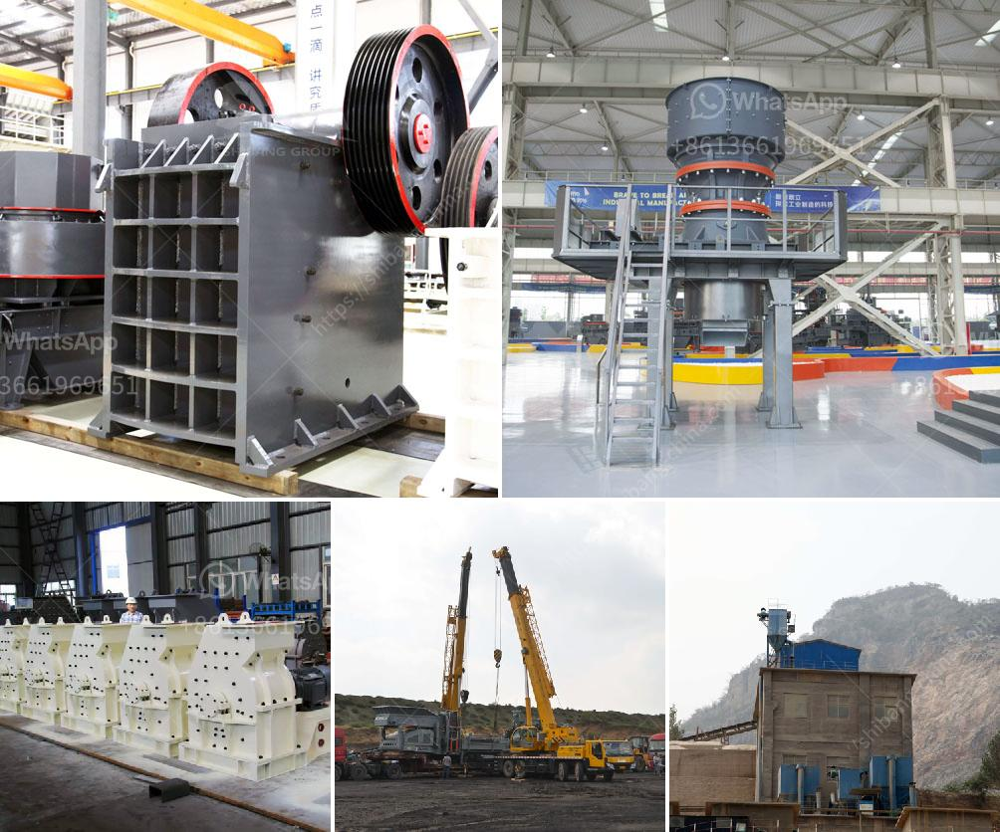

<h3>grinding media balls suppliers in south africa</h3>
Grinding media balls are used in a variety of industries for the reduction of particle size, including cement, power generation, mining, and more. These balls are manufactured from high-quality materials that are hardened for exceptional wear resistance and long lifespan. In South Africa, there are several grinding media balls suppliers with a strong reputation in the industry.

GMSA is the leading supplier of high-quality grinding media. They are the only supplier offering a wide range of grinding media under one roof. They manufacture various sizes of grinding media balls used in various industries including cement, mining, and thermal power generation.

Scaw Metals Group is a leading producer of high chrome and forged grinding media balls supplied primarily to the African platinum, copper, and gold mining industries. They are the largest supplier of grinding media in Africa.

Magotteaux is the global leader in the production of grinding media balls. They offer a full range of products, such as high-chrome, cast and forged grinding balls, ceramic grinding balls, and rods. They also specialize in optimizing liner systems and designing high-performance grinding media.

Grinding Media South Africa is a newly corporatized South African based company supplying forged grinding balls, cast grinding balls, and grinding rods to the mining, cement, and thermal power generation industries. They are proud to have extensive technical expertise and local manufacturing facilities.

Cape Gate Holdings is a leading supplier of steel products and accessories in South Africa. They manufacture high-quality grinding media balls used in the mining industry. They offer a comprehensive range of grinding media balls with different specifications and hardness to cater to various mining environments.

In conclusion, South Africa is home to several reputable grinding media balls suppliers catering to various industries. These suppliers provide high-quality products with exceptional wear resistance and long lifespan. Whether it's for the cement, mining, or power generation industry, South Africa has a wide range of grinding media balls suppliers to meet their needs.
<h3>Contact us</h3><ul><li><strong>Whatsapp:&nbsp;<a href="https://wa.me/8613661969651">+8613661969651</a></strong></li><li><a href="https://swt.shibang-china.com/?git&amp;zhl&amp;grinding media balls suppliers in south africa"><strong>Online Service(chat now)</strong></a></li></ul><h3>Related</h3><ul><li><a href='portable gold mining hammer mills.md'>portable gold mining hammer mills</a></li><li><a href='project report of a tph stone crusher.md'>project report of a tph stone crusher</a></li><li><a href='accessories for chia conveyor belts.md'>accessories for chia conveyor belts</a></li><li><a href='turkey plant production line of gypsum powder.md'>turkey plant production line of gypsum powder</a></li><li><a href='cost of crushed concrete.md'>cost of crushed concrete</a></li></ul>