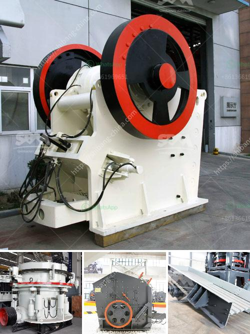

<h3>grinding mill gold ore</h3>
Gold has been a precious metal for centuries, captivating the imagination of civilizations with its gleaming beauty and valuable attributes. While mining gold is not a new phenomenon, the methods and technologies used to extract this precious metal have significantly evolved. One of the key advancements in gold mining is the introduction of grinding mills, which have revolutionized the extraction process.

Grinding mills are specialized machines that grind crushed gold ore into fine particles, allowing for the separation of the valuable gold from the unwanted rock or minerals. This process is essential as gold ore is often too large or contains impurities that hinder its extraction. By grinding the ore, the surface area is increased, making it easier for chemicals and leaching agents to react with the gold particles.

The gold extraction process using grinding mills involves several stages. First, the gold ore is fed into the mill where it is crushed and ground into smaller particles. The ground ore is then mixed with water and chemicals to create a slurry. This slurry is transported to a leaching tank, where chemicals such as cyanide are added to dissolve the gold. Finally, the gold-laden solution is separated from the remaining rock particles, and the gold is recovered through further refining processes.

The efficiency and effectiveness of grinding mills in gold ore processing cannot be overstated. These machines not only increase the gold extraction rate but also reduce the environmental impact of mining. By grinding the ore, less energy is required for subsequent processing stages, resulting in lower carbon emissions and overall resource consumption.

Moreover, grinding mills have opened new possibilities for previously uneconomic gold deposits. With traditional extraction methods, low-grade ores were often deemed unprofitable to mine. However, grinding mills have made it economically viable to extract gold from these deposits, unlocking their potential and maximizing resource utilization.

In conclusion, grinding mills have revolutionized the gold extraction process by increasing efficiency and reducing environmental impact. These machines have made it possible to extract gold from previously uneconomic deposits, opening new opportunities for the mining industry. As technology continues to advance, we can expect further innovations in grinding mills and other mining equipment, bringing us closer to a sustainable and responsible gold mining industry.
<h3>Contact us</h3><ul><li><strong>Whatsapp:&nbsp;<a href="https://wa.me/8613661969651">+8613661969651</a></strong></li><li><a href="https://swt.shibang-china.com/?git&amp;zhl&amp;grinding mill gold ore"><strong>Online Service(chat now)</strong></a></li></ul><h3>Related</h3><ul><li><a href='to calculate cost of limestone production in mining.md'>to calculate cost of limestone production in mining</a></li><li><a href='manufacturer of cement packing plant machinery.md'>manufacturer of cement packing plant machinery</a></li><li><a href='hammer mills price.md'>hammer mills price</a></li><li><a href='how much does a quarry machine cost.md'>how much does a quarry machine cost</a></li><li><a href='calcium carbonate crushers.md'>calcium carbonate crushers</a></li></ul>