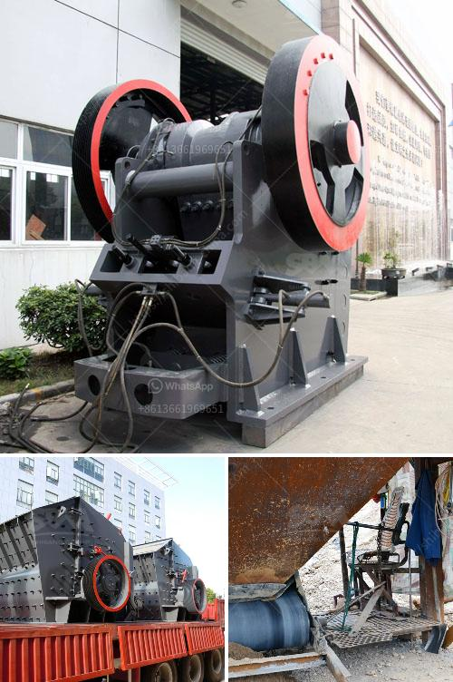

<h3>grinding mill grinding machine grinders grinning mill</h3>
Grinding mills have been used for centuries to grind various materials. From traditional grains such as wheat and corn to industrial materials like minerals and cement, grinding mills are the efficient tools that can grind these materials into fine powders or particles. The process of grinding involves the use of a grinding machine to break down the material into smaller pieces, allowing for its transformation into the desired product.

The modern grinding mill has evolved significantly since its inception. Technological advancements have led to the development of more efficient and versatile grinding machines, making the process faster, smoother, and more precise. The range of grinders available in the market today is vast, each designed to cater to specific needs and applications.

One such grinder is the grinning mill. This high-performance grinding machine offers exceptional grinding capabilities due to its advanced features and functionalities. With its powerful motor and adjustable settings, the grinning mill can grind materials into fine particles with ease. Whether it is grinding grains for flour or reducing minerals to powder, this machine ensures a consistent and uniform grind every time.

A major advantage of using a grinding mill is its ability to grind a wide range of materials. From soft to hard materials, wet or dry, a grinding mill can handle it all. This versatility makes it a popular choice across various industries, including agriculture, mining, pharmaceuticals, and chemical manufacturing.

In terms of efficiency, grinding mills are designed to minimize energy consumption while maximizing output. By optimizing the grinding process, these machines ensure minimal waste and maximum productivity. The result is not only cost savings but also improved overall production quality.

In conclusion, grinding mills are essential tools in various industries. Capable of grinding a variety of materials, these machines are efficient and versatile, ensuring consistent and fine grinding results. With advancements in technology, grinders like the grinning mill have taken the grinding process to new heights, providing superior performance and productivity. Whether it's for commercial or industrial purposes, a grinding mill is an invaluable tool for those seeking efficient and reliable grinding solutions.
<h3>Contact us</h3><ul><li><strong>Whatsapp:&nbsp;<a href="https://wa.me/8613661969651">+8613661969651</a></strong></li><li><a href="https://swt.shibang-china.com/?git&amp;zhl&amp;grinding mill grinding machine grinders grinning mill"><strong>Online Service(chat now)</strong></a></li></ul><h3>Related</h3><ul><li><a href='processing of kaolin crusher.md'>processing of kaolin crusher</a></li><li><a href='small ball mill prices in kenya.md'>small ball mill prices in kenya</a></li><li><a href='india 200 tpd cement plant cost.md'>india 200 tpd cement plant cost</a></li><li><a href='quartz rock processing equipment.md'>quartz rock processing equipment</a></li><li><a href='conveyor belt seller in philippines.md'>conveyor belt seller in philippines</a></li></ul>