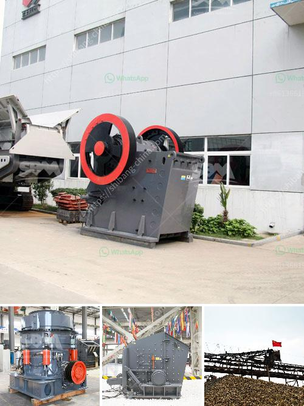

<h3>grinding mill machine in ethiopia</h3>
Ethiopia is a country blessed with a wealthy agricultural landscape that allows for the cultivation of various crops. One of the most significant crops in Ethiopia is grain, which is central to the country's food security and economic growth. With an increasing population and a growing demand for affordable and nutritious food products, the need for efficient grain processing machinery has become essential.

A grinding mill machine is an essential piece of equipment in the grain processing industry because of its versatility and efficiency. Ethiopia sits on ample grain reserves and is a major producer and exporter of grains such as wheat, corn, and barley. However, before these grains reach the market, they require processing and grinding to meet the desired quality and specifications.

Investing in a grinding mill machine in Ethiopia offers a cost-effective solution for processing grain to enhance its nutritional value and improve its marketability. The machine grinds grain to a fine consistency, allowing the integration of various grains into staple foods such as bread, pasta, and porridge. Additionally, grinding grains provides advantages such as increased digestibility and improved taste and texture.

With a grinding mill machine, farmers and agrarian communities can process and package their grains instead of selling raw products at a lower price. By adding value to their products through processing, farmers can improve their income and overall economic status. The availability of a grinding mill machine in rural areas can bridge the gap between urban and rural populations by stimulating local economies and reducing migration to cities.

Furthermore, grinding mill machines in Ethiopia do not only process grains but also various other commodities such as spices, coffee, cocoa, and nuts. These machines have a versatile design, allowing for the processing of different products without cross-contamination. This versatility makes them a suitable investment for entrepreneurs who want to engage in diverse agribusiness ventures.

In recent years, the demand for grinding mill machines in Ethiopia has skyrocketed due to the increasing number of small-medium enterprises (SMEs) and the rise of urbanization. These businesses require affordable and efficient milling equipment to meet their processing needs. Fortunately, various manufacturers and suppliers are offering quality grinding mill machines that are both reliable and cost-effective.

When choosing a grinding mill machine in Ethiopia, it is crucial to consider several factors. Firstly, the machine should be manufactured with high-quality materials to ensure durability and longevity. This ensures that the machine can withstand the harsh conditions often present in rural areas and continue to perform optimally over an extended period.

Secondly, the machine's design should be user-friendly, allowing for easy operation and maintenance. This is especially important in rural areas where access to technical support may be limited. A grinding mill machine with simple and intuitive controls enables operators to maximize its potential without extensive training.

Lastly, affordability plays a significant role in the decision-making process. Local governments and development agencies may provide support to individuals and communities looking to invest in grinding mill machines. It is important to research available funding options and negotiate favorable terms to minimize the financial burden of acquiring the equipment.

In conclusion, investing in a grinding mill machine in Ethiopia can bring numerous benefits to farmers, agribusinesses, and the overall economy. Such machines enhance food processing capabilities, increase income generation, and contribute to value addition in the agricultural sector. With the appropriate selection and support, these machines can be a catalyst for positive transformation in Ethiopia's grain processing industry.
<h3>Contact us</h3><ul><li><strong>Whatsapp:&nbsp;<a href="https://wa.me/8613661969651">+8613661969651</a></strong></li><li><a href="https://swt.shibang-china.com/?git&amp;zhl&amp;grinding mill machine in ethiopia"><strong>Online Service(chat now)</strong></a></li></ul><h3>Related</h3><ul><li><a href='used crushers prices in nigeria.md'>used crushers prices in nigeria</a></li><li><a href='floatation method of analysis for silica sand.md'>floatation method of analysis for silica sand</a></li><li><a href='european jaw crusher.md'>european jaw crusher</a></li><li><a href='mobile crusher seller.md'>mobile crusher seller</a></li><li><a href='quartz stone machine price.md'>quartz stone machine price</a></li></ul>